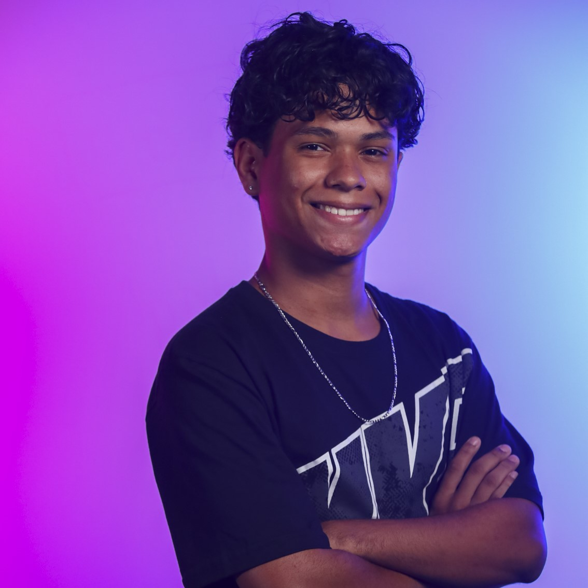

# Inteli - Instituto de Tecnologia e Liderança

 

# .Nemo

## Lamarr

## 👨‍🎓 Integrantes:

|  |  |  |                               |
| ------------------------------------------------------------------------------------------------------------------------------------------------ | ------------------------------------------------------------------------------------------------------------------------ | --------------------------------------------------------------------------------------------------------------------------------- | ------------------------------------------------------------------------------------------------------------------------------------------- |
| Fabiana Martins                                                                                                                                  | Erik Silva                                                                                                               | Ever Feliphe                                                                                                                      | Gustavo Widman                                                                                                                              |
|                |     |                |  |
| Mário Ventura                                                                                                                                    | Maurício Azevedo                                                                                                         | Otto Lima                                                                                                                         | Samuel Nascimento                                                                                                                           |

## 👩‍🏫 Professores:

### Orientador(a)

- <a href="https://www.linkedin.com/in/fabiana-martins-de-oliveira-8993b0b2/">🧭 Fabiana Martins de Oliveira </a>

### Instrutores

- <a href="https://www.linkedin.com/in/rafael-jacomossi-6135b0a1/">📈 Rafael Jacomossi - Professor de Business</a>
- <a href="https://www.linkedin.com/in/vthayashi/">👨‍💻 Victor Hayashi - Professor de Computação</a>
- <a href="https://www.linkedin.com/in/flaviomarquesazevedo/">👨‍💻 Flávio Azevedo - Professor de Computação</a>
- <a href="https://www.linkedin.com/in/sergio-venancio-a509b342/">🎨 Sergio Venancio - Professor de Design UX/UI </a>
- <a href="https://www.linkedin.com/in/bruna-mayer-00a556174/">🎨 Bruna Mayer - Professoar de Design UX/UI </a>
- <a href="https://www.linkedin.com/in/henrique-mohallem-paiva-6854b460/">🧮 Henrique Mohallem - Professor de Matemática</a>
- <a href="https://www.linkedin.com/in/profclaudioandre/">👑 Claudio André - Professor de Liderança </a>

### Coach de carreira

- <a href="https://www.linkedin.com/in/thais-bassani/">💪 Thaís Bassani</a>

## 📜 Descrição

O projeto .Nemo, desenvolvido pelo grupo Lamarr, foi meticulosamente projetado para atender às necessidades de rastreamento e gerenciamento de ativos da Rede Nacional de Ensino e Pesquisa (RNP). Com uma abordagem dupla, o projeto .Nemo abrange duas vertentes. A primeira delas utiliza equipamentos com sensores RFID para a identificação e rastreamento de ativos via GPS. Esta solução permite monitorar em tempo quase que  real a localização e o status dos ativos, permitindo que o cliente tenha uma visão clara e precisa do inventário. Já a segunda vertente do projeto oferece uma solução de mais baixo custo, utilizando QR Codes como alternativa às tags e sensores RFID. Essa abordagem é particularmente adequada para que a RNP tenha flexibilidade e liberdade de escolha para aquela solução que melhor atenda às necessidades que ela observar.

[Clicando aqui](https://youtu.be/5IbQflfqY68) será possível ver um vídeo de demonstração da solução. 
Além disso, é possível acessar o dashboard da aplicação [neste link](https://dotnemo.tech/).

## 📁 Estrutura de pastas

Dentre os arquivos e pastas presentes na raiz do projeto, definem-se:

- <b>assets</b>: aqui estão os arquivos relacionados a parte gráfica do projeto, ou seja, as imagens e vídeos que os representam (O logo do grupo pode ser adicionado nesta pasta).

- <b>document</b>: aqui estão todos os documentos do projeto, incluindo o manual de instruções (se aplicável). Há também uma pasta denominada <b>outros</b> onde estão presentes outros documentos complementares.

- <b>src</b>: Todo o código fonte criado para o desenvolvimento do projeto, incluindo firmware, notebooks, backend e frontend, se aplicáveis.

- <b>README.md</b>: arquivo que serve como guia e explicação geral sobre o projeto (o mesmo que você está lendo agora).

## 🔧 Instalação

Para saber como iniciar e utilizar este projeto, é necessário acessar o nosso manual de instruções que se encontra [clicando aqui.](https://github.com/2023M4T8Inteli/grupo3/blob/main/document/outros/Manual%20de%20instru%C3%A7%C3%B5es.pdf)

## 🗃 Histórico de lançamentos

- 0.1.0 - 29/10/2023
  - Preenchimento da documentação com o entendimento do negócio, fundamentos da experiência do usuário, requisitos funcionais e prototipação inicial no Wokwi.
- 0.2.0 - 12/11/2023
  - Testagem e documentação do primeiro protótipo físico já online, levantamento de requisitos não funcionais, wireframes da solução web e desenho esquemático da solução.
- 0.3.0 - 29/11/2023
  - Testagem e documentação de protótipos físicos de leitor RFID e GPS conectados à internet e se comunicando via protocolo MQTT, apresentação de arquitetura da solução e aplicação web que apoiará a solução.
- 0.4.0 - 10/12/2023
  - Testagem e documentação via diagramas UML de protótipos físicos de leitor RFID e GPS conectados à internet e se comunicando via protocolo MQTT, apresentação de arquitetura da solução.
- 1.0.0 - 20/12/2023
  - Lançamento da primeira versão final do protótipo.

## 📋 Licença/License

<a property="dct:title" rel="cc:attributionURL" href="https://github.com/2023M4T8Inteli/grupo3">.Nemo</a> by <a rel="cc:attributionURL dct:creator" property="cc:attributionName" href="https://www.inteli.edu.br/">Inteli, Erik Silva, Ever Felliphe, Gustavo Widman, Mário Ventura, Maurício Azevedo, Otto Lima, Samuel Nascimento.</a> is licensed under <a href="http://creativecommons.org/licenses/by/4.0/?ref=chooser-v1" target="_blank" rel="license noopener noreferrer" style="display:inline-block;">Attribution 4.0 International</a>

