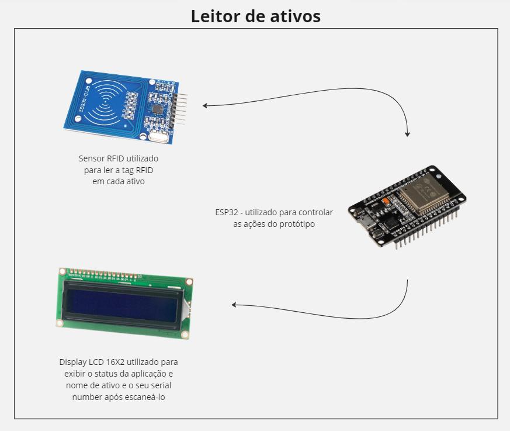
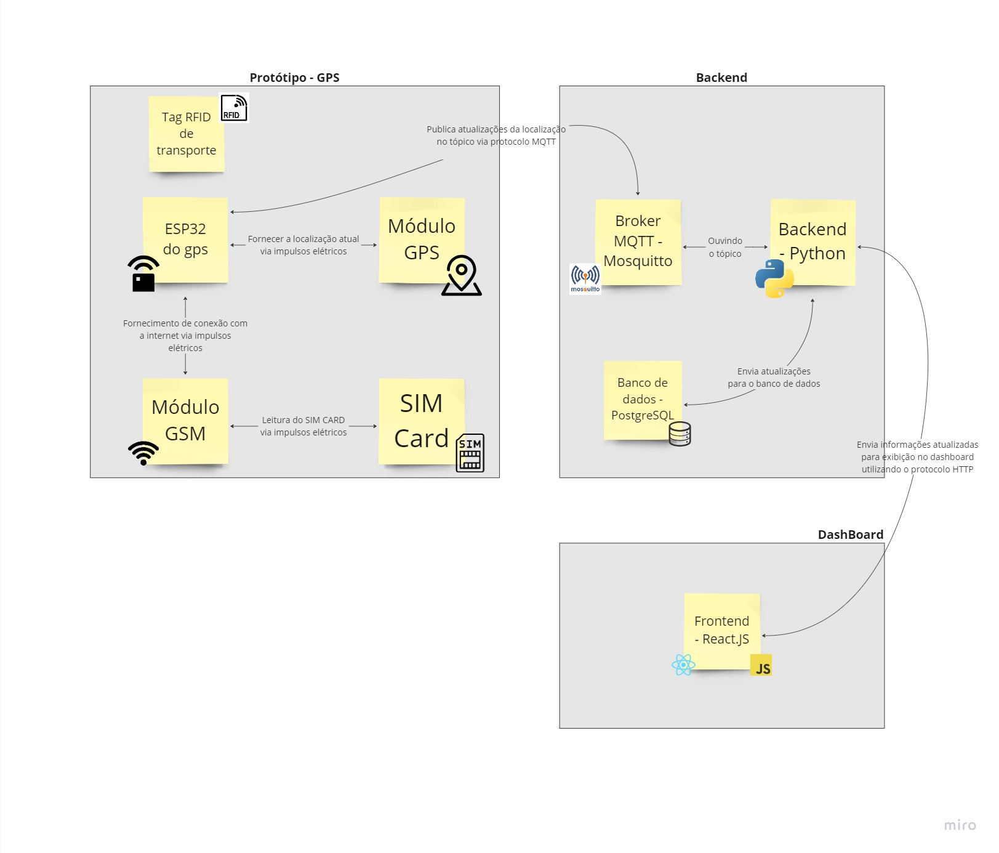

# Documentação IoTDoc - Módulo 4 - Inteli

## Lamarr

#### Erik Silva, Ever Felliphe, Gustavo Widman, Mário Ventura, Maurício Azevedo, Otto Lima, Samuel Nascimento.

## Sumário

[1. Introdução](#c1)

[2. Metodologia](#c2)

[3. Desenvolvimento e Resultados](#c3)

[4. Possibilidades de Descarte](#c4)

[5. Conclusões e Recomendações](#c5)

[6. Referências](#c6)

 

# 1. Introdução

&emsp;Fundada em 1989, a Rede Nacional de Ensino e Pesquisa (RNP) é uma organização social vinculada ao Ministério da Ciência, Tecnologia e Inovação (MCTI) em conjunto com os ministérios da Educação (MEC), das Comunicações (MCom), Cultura, Saúde (MS) e Defesa (MD), que participam do Programa Interministerial RNP (PRO-RNP). Atua disponibilizando internet segura e de alta capacidade focada na área de ensino, englobando escolas e universidades. Além disso, oferecem serviços personalizados e promovem projetos de inovação.

&emsp;Seu objetivo é ser reconhecido no Brasil como a instituição que, fazendo o uso inovador das tecnologias de informação e comunicação, provê a integração global da comunidade acadêmica, contribuindo para a melhoria da qualidade do ensino e da pesquisa e colaborando com o desenvolvimento tecnológico, social e econômico do país. Com foco principal em oferecer internet a todas as instituições de ensino no Brasil, a empresa opera em todo o território nacional.

&emsp;A RNP ganhou destaque no mercado, conseguindo uma atuação nacional nas instituições de ensino e em seus variados projetos variados relacionados à tecnologia. No entanto, em função de sua incrível expansão, a empresa não consegue manter um controle efetivo de todos os seus ativos, gerando perdas em parte desses equipamentos, que culminam em um custo maior para repor tais bens.

## 1.1 Objetivos

&emsp;De maneira geral, o desenvolvimento deste projeto objetiva a construção de uma solução para otimizar a gestão dos ativos da RNP que estão espalhados pelo Brasil, permitindo verificar facilmente a sua localização e identificação. Dessa forma, a tomada de decisão por parte do setor de engenharia em relação ao desenvolvimento de novos projetos, manutenção e substituição de bens e planejamento de estoque estratégico é facilitada. Para que o propósito da solução seja atingido, este grupo objetiva desenvolver uma solução que:

&emsp;i) Seja escalável e permita para localização dos ativos da empresa, possibilitando assim que ela seja aplicável em toda a sua área de atuação, que inclui todo o território brasileiro;

&emsp;ii) Forneça informações precisas sobre cada ativo, o que inclui dados como número serial, especificações técnicas e status de garantia;

&emsp;iii) Permita a consulta quanto ao status e histórico de movimentações entre bases de atuação da RNP de cada ativo.

&emsp;Desta forma, este projeto apresenta uma abordagem eficiente para a gestão de ativos da RNP em todo o território brasileiro. Permitindo a escalabilidade, esta solução abrange não apenas a localização e identificação dos ativos, mas também provê informações detalhadas, incluindo dados técnicos e histórico de movimentações de cada um deles. O desenvolvimento desse projeto pode ser interpretado como uma ferramenta de suma imporância para a RNP, uma vez que otimiza processos de manutenção, substituição de bens e planejamento estratégico de estoque.

## 1.2 Proposta da solução

&emsp;A solução encontrada para o problema apresentado é composta de 5 partes:
-Um leitor de RFID (Identificação por Radiofrequência) em cada armazém ou ponto de descarga da RNP ou parceiros.
-Tags RFID em cada ativo para identificação e atribuição de características.
-Localizador em cada carga de transporte.
-Localizador + tag RFID para ativos de alto valor agregado.
-Aplicação WEB para monitoramento e administração dos ativos.

&emsp;Em cada ativo será colocado uma tag de identificação com tecnologia RFID. Nela será guardado informações como número de série, tipo de ativo e outras que ajudem a identificar o respectivo produto. Além disso, existirá o localizador, composto por um módulo GPS, o microcontrolador e uma tag RFID que irá guardar a informação de localização da carga de transporte e também um módulo GSM para conexão com a internet.
&emsp;Para realizar a leitura dessas informações será necessário um leitor, composto por um LCD, alguns botões, um leitor RC522 e um ESP32 como microcontrolador. Este irá ler primeiramente o rastreador, confirmando a localização da carga, e depois a leitura de cada ativo, validando o transporte e status de cada item.
&emsp;Contudo, considerando que alguns ativos podem ser considerados de alto valor, será desenvolvido também tags com rastreamento próprio. Essas tags guardarão, além das informações de identificação, a localização de ativos considerados “valiosos”. Por fim, para administração desses ativos, será desenvolvido uma aplicação web composta de dashboards, serviços de localização e de monitoramento de status para cada ativo. Isso facilitará a visualização de dados colhidos pelos dispositivos IoT.

## 1.3 Justificativa

&emsp;A implementação da solução descrita apresenta uma abordagem inovadora para a gestão de ativos e logística, com potenciais e benefícios notáveis que a diferenciam de abordagens convencionais. Esta proposta representa um avanço significativo para a empresa em vários aspectos.
&emsp;Potenciais da Solução:
-Rastreamento Completo: A solução oferece um rastreamento abrangente de ativos, desde a identificação por RFID até a localização por GPS. Isso permite à empresa ter um controle preciso sobre a localização e o status de seus ativos em tempo real, aumentando a segurança e a eficiência.
-Adaptação a Ativos de Alto Valor: A capacidade de desenvolver tags com rastreamento próprio para ativos de alto valor agrega uma camada adicional de segurança, garantindo que os ativos mais críticos sejam monitorados de forma especializada.
-Acesso Simplificado por Aplicação Web: A aplicação web proporciona um ponto central de monitoramento e administração, tornando a gestão de ativos mais acessível a todos os departamentos da empresa. Isso elimina a necessidade de comunicação interdepartamental para obter informações cruciais.
&emsp;Benefícios da Solução:
-Redução de Atrasos e Desperdício de Tempo: A empresa verá uma diminuição significativa nos atrasos desnecessários, uma vez que os engenheiros podem verificar o status dos ativos de que precisam de forma direta e instantânea, melhorando a eficiência de projetos e processos.
-Melhoria da Segurança e Redução de Riscos: O rastreamento abrangente aumenta a segurança, impedindo perdas e roubos, além de possibilitar uma resposta rápida a problemas operacionais, minimizando riscos.
-Melhoria de Tomada de Decisão: A solução fornece dados em tempo real que podem ser usados para tomar decisões informadas, otimizando o uso de recursos e a alocação de ativos.
&emsp;Diferenciação da Solução:
O que diferencia esta solução é a combinação de tecnologias avançadas, incluindo RFID, GPS, e conectividade web, que oferecem uma abordagem completa de rastreamento e gerenciamento de ativos. Além disso, a ênfase na capacidade de rastreamento personalizado para ativos de alto valor demonstra um compromisso com a segurança e proteção dos recursos da empresa.
Em resumo, a implementação desta solução não apenas resolve os desafios operacionais atuais, mas também cria um ambiente mais eficiente, seguro e ágil, que está alinhado com as demandas de um ambiente de negócios em constante evolução. A empresa colherá os frutos desses benefícios, tornando-se mais competitiva e eficaz em suas operações.

&emsp;Assim, a justificativa para a implementação da solução é clara e centra-se na inovação e eficiência na gestão de ativos. A integração de tecnologias como o RFID e GPS e projeção dos dados em uma interface web oferecerá um sistema de rastreamento completo e adaptado, especialmente para ativos de alto valor, garantindo segurança aprimorada e gestão eficiente.

# 2. Metodologia

&emsp; Uma metodologia pode ser definida como o conjunto sistemático de princípios e práticas usadas para guiar a realização de um objetivo específico. Para este projeto, utilizar-se-á metodologia RM-ODP, ou Reference Model for Open Distributed Processing, é um conceito que se aplica a sistemas capazes de realizar processamento distribuído de forma heterogênea, tanto dentro de uma organização quanto entre diferentes organizações. A International Organization for Standardization (ISO) e a International Telecommunication Union - Telecommunication Standardization Sector (ITU-T), anteriormente conhecida como Comité Consultatif International Téléphonique et Télégraphique (CCITT), colaboraram no desenvolvimento do Reference Model for Open Distributed Processing (RM-ODP). Este modelo visa fornecer uma estrutura de coordenação para padronizar o ODP, estabelecendo uma arquitetura que promove distribuição, integração no trabalho, interoperabilidade e portabilidade.

&emsp;Neste contexto, Linington et. al. (2012), assume destaque como uma obra significativa. O livro apresenta uma abordagem acessível e aplicada, direcionada a arquitetos e engenheiros de software interessados em assimilar os princípios fundamentais do RM-ODP. Este padrão, estabelecido internacionalmente, destaca-se como uma referência crucial para atender às demandas dinâmicas do ambiente de negócios no cenário de sistemas empresariais complexos e distribuídos.

&emsp;A teoria subjacente ao RM-ODP enfatiza a necessidade de estruturar sistemas distribuídos de maneira sistemática, levando em consideração as preocupações dos stakeholders. Propõe a expressão do design por meio de uma série de visões vinculadas, permitindo que cada stakeholder desenvolva uma perspectiva apropriada com o mínimo de interferência.

&emsp;No âmbito dos sistemas empresariais, onde a habilidade de projetar soluções eficazes é essencial, o RM-ODP destaca-se não apenas como uma abordagem teórica, mas como um guia prático para a construção de sistemas robustos. Ao explorar o Unified Modeling Language (UML), essa metodologia oferece uma abordagem acessível, possibilitando a expressão clara de designs baseados nos princípios fundamentais do RM-ODP. Essa integração do UML simplifica o processo de especificação em ambientes de modelagem, estabelecendo uma ponte direta entre a teoria e a aplicação prática em projetos reais.

&emsp;A metodologia RM-ODP, em sua abrangência, incorpora os cinco pontos de vista essenciais (empreendedorismo, informação, computação, tecnologia e engenharia), os quais serão explorados em detalhes posteriormente. Essa análise aprofundada proporcionará uma compreensão mais precisa da aplicação desses conceitos.

&emsp;Segundo Raymond (1995), do ponto de vista do empreendedorismo, ao olharmos para como as empresas organizam suas operações em sistemas de computação distribuída, surge uma abordagem chamada "ponto de vista empresarial" dentro de uma metodologia chamada RM-ODP. Nesse contexto, objetos como gerentes, caixas e contas bancárias são identificados, e eles se agrupam em comunidades, como uma agência bancária. Dentro dessas comunidades, regras são definidas, como o que pode ser feito (permissões), o que não pode (proibições) e o que deve ser feito (obrigações).

&emsp;Imaginemos, por exemplo, um banco. A mudança nas taxas de juros é uma ação importante que cria obrigações para o gerente informar os clientes, enquanto obter o saldo da conta não tem o mesmo impacto nas regras do sistema. Ao criar aplicativos de computação distribuída, a abordagem empresarial permite que as regras sejam decididas pela própria organização, evitando serem impostas por escolhas de tecnologia. Isso ajuda a garantir que a estrutura da empresa guie o desenvolvimento tecnológico de maneira flexível e alinhada.

&emsp;O mesmo autor defende ainda que, do ponto de vista de informação, ao desenvolver um aplicativo para um banco é como um plano que nos ajuda a entender quais dados são essenciais para o funcionamento adequado do aplicativo. No contexto dos dados bancários, essas informações são chamadas de "esquemas". Um esquema descreve o estado de um objeto, como uma conta bancária que possui um saldo e a "quantidade retirada hoje". Existem dois tipos de esquemas: o "estático", que mostra como o objeto está em um momento específico, como à meia-noite, quando a quantidade retirada hoje é $0.

&emsp;Há também o "invariante", que estabelece regras consistentes, como a quantidade retirada hoje sempre sendo menor ou igual a $500. Além disso, temos o "dinâmico", que indica como o objeto pode mudar. Por exemplo, se retirarmos $X de uma conta, o saldo diminui em $X, e a quantidade retirada hoje aumenta em $X. Essas mudanças sempre seguem as regras do esquema invariante. Portanto, se já retiramos $400 de manhã, não podemos retirar mais $200 à tarde, pois ultrapassa os $500. Os esquemas também podem descrever relações entre objetos, como associar cada conta a um cliente.

&emsp;E para situações mais complexas, podemos combinar diferentes esquemas, como quando uma agência bancária é formada por clientes, contas e as relações entre eles. Em resumo, o ponto de vista de informação funciona como um guia que aponta quais dados são necessários para o bom funcionamento do nosso aplicativo bancário. Existem várias maneiras de expressar essas informações, como o uso de modelos de relacionamento, esquemas conceituais e técnicas mais formais, como o Z.

&emsp;Segundo Raymond (1995), no ponto de vista empresarial, sistemas de computação distribuída em empresas são organizados de maneira única. Objetos como gerentes e contas bancárias formam comunidades com regras definidas - permissões, proibições e obrigações. Por exemplo, em um banco, a mudança nas taxas de juros cria obrigações específicas, como informar os clientes, enquanto operações mais simples, como verificar o saldo, têm menor impacto nas regras do sistema. Esta abordagem permite que as regras sejam estabelecidas pela própria organização, alinhando o desenvolvimento tecnológico com a estrutura empresarial de forma flexível.

&emsp;Considere uma rede de supermercados. Nesta visão, são definidas as regras de negócio como promoções que podem ser oferecidas, os tipos de pagamentos aceitos, e os procedimentos para devoluções. Por exemplo, uma promoção "leve 3 pague 2" cria uma obrigação para os caixas aplicarem o desconto, enquanto uma política de devolução estabelece as condições sob as quais os clientes podem retornar produtos.

&emsp;Visão de Informação: Esta visão lida com os dados essenciais para o funcionamento de um aplicativo. No contexto bancário, esquemas de dados como "saldo da conta" e "quantidade retirada hoje" são exemplos. Esses esquemas incluem estados estáticos e invariantes, como o saldo à meia-noite, e estados dinâmicos, que descrevem como os objetos mudam, respeitando as regras estabelecidas. Esquemas também podem descrever relações entre diferentes objetos, como clientes e suas contas, e podem ser expressos através de modelos de relacionamento, esquemas conceituais e técnicas formais.

&emsp;Imaginemos um sistema de biblioteca pública. Nesta visão, modelaríamos os esquemas de dados como registros de livros, usuários e empréstimos. Um esquema estático poderia ser a lista atual de livros disponíveis na biblioteca, enquanto um esquema dinâmico descreve como os registros de empréstimos são atualizados quando um usuário retira ou devolve um livro.

&emsp;Visão Computacional: Esta visão especifica a funcionalidade de uma aplicação ODP, detalhando elementos baseados em objetos que encapsulam dados e processamento. Os objetos definidos na visão computacional são projetados para interagir uns com os outros de maneira distribuída, permitindo que a aplicação funcione eficientemente em ambientes de computação distribuída. Esta visão foca na definição de interfaces e na interação entre objetos, garantindo que o sistema seja modular e possa ser facilmente escalável.

&emsp;Dentro desta visão, um aspecto importante é o conceito de subtipagem de interface. Subtipagem de interface permite que diferentes objetos apresentem interfaces compatíveis, mesmo que suas implementações internas sejam diferentes. Isso é crucial para garantir a interoperabilidade e a substituibilidade de componentes em um sistema distribuído. Por exemplo, em um aplicativo de e-commerce, diferentes tipos de sistemas de pagamento (como cartão de crédito, PayPal, ou transferência bancária) podem implementar uma interface de pagamento comum. Essa interface comum assegura que, independentemente do método de pagamento escolhido pelo usuário, o processo de transação possa ser realizado de maneira consistente e integrada ao resto do sistema.

&emsp;Voltando ao exemplo do aplicativo de e-commerce, a visão computacional não só define as funções de cada objeto, como um carrinho de compras que permite adicionar e remover produtos, ou um sistema de pagamento que processa transações financeiras, mas também estabelece como essas interfaces podem ser adaptadas ou estendidas para diferentes tipos de operações ou tecnologias, mantendo a compatibilidade entre elas.

&emsp;Por exemplo, se um novo método de pagamento for introduzido, ele pode ser integrado ao sistema desde que siga a interface de pagamento estabelecida. Isso permite que o aplicativo evolua e se adapte às mudanças tecnológicas e às preferências dos usuários, mantendo a coesão e a funcionalidade do sistema como um todo. Portanto, a subtipagem de interface na visão computacional do RM-ODP é essencial para criar sistemas escaláveis e flexíveis, capazes de se adaptar a novas exigências e tecnologias sem comprometer a integração e a funcionalidade geral do sistema.

&emsp;Visão de Engenharia: A visão de engenharia no RM-ODP, focada no design orientado à distribuição, é crucial na definição da infraestrutura de sistemas distribuídos. Ela considera aspectos como a localização de componentes, comunicação entre diferentes partes do sistema e gerenciamento de recursos. Um elemento fundamental nesta visão são os canais, que desempenham um papel vital na facilitação da comunicação e interação entre diferentes componentes de um sistema distribuído.

&emsp;Os canais representam os meios pelos quais os objetos em um sistema distribuído comunicam e interagem. Eles são abstrações que encapsulam os detalhes de comunicação, como protocolos de rede, formatos de mensagem e mecanismos de transmissão. Os canais são projetados para serem transparentes para os usuários e desenvolvedores, significando que eles podem focar nas funcionalidades e lógicas do negócio sem se preocupar com os detalhes complexos da comunicação de rede.

&emsp;Ao aplicar esta visão em um serviço de streaming de vídeo, os canais seriam responsáveis por várias funções críticas:
Os canais podem gerenciar a transmissão de fluxos de vídeo dos servidores de mídia para os dispositivos dos usuários. Eles assumiriam a responsabilidade dos aspectos técnicos, como ajustar a qualidade do vídeo com base na largura de banda disponível e garantir a entrega contínua e sem interrupções.

&emsp;Ademais, canais facilitariam a comunicação entre os servidores de back-end e os aplicativos dos clientes, permitindo funções como autenticação de usuário, seleção de conteúdo e feedback de qualidade de serviço. Em um sistema de streaming, os canais também podem ser responsáveis pela distribuição de carga, direcionando os pedidos dos usuários para os servidores mais próximos ou menos carregados, e garantindo redundância para alta disponibilidade. Além do conteúdo de vídeo, os canais também gerenciam a transmissão de metadados (como títulos, descrições, classificações) e controlam o acesso ao conteúdo com base em assinaturas ou permissões do usuário.

&emsp;Integrando estes aspectos, a visão de engenharia, com seu foco em canais, garante que os sistemas distribuídos, como serviços de streaming de vídeo, sejam não apenas funcionais e eficientes, mas também escaláveis e fáceis de manter. Os canais desempenham um papel crucial em abstrair a complexidade da infraestrutura de rede, permitindo que os desenvolvedores se concentrem em oferecer uma experiência de usuário rica e ininterrupta.

&emsp;Visão Tecnológica: Por fim, a visão tecnológica lida com a implementação concreta do sistema. Ela cobre aspectos como a seleção de hardware e software, detalhes de implementação específicos e considerações sobre compatibilidade e portabilidade. Esta visão é crucial para garantir que a aplicação possa ser efetivamente implementada, testada e mantida em ambientes de computação reais.

&emsp;Por exemplo, no desenvolvimento de um sistema de gestão hospitalar, esta visão detalharia as escolhas de hardware e software específicos, como servidores, bancos de dados, e linguagens de programação. Também consideraria questões de compatibilidade com equipamentos médicos existentes e normas de segurança de dados. Portanto, o RM-ODP, ao abordar esses cinco pontos de vista, fornece um framework robusto e abrangente para o design e implementação de sistemas distribuídos complexos, garantindo que todas as facetas do desenvolvimento sejam cuidadosamente consideradas e integradas de forma eficaz.

&emsp;Em síntese, o Reference Model for Open Distributed Processing (RM-ODP) representa uma metodologia normativa que estabelece diretrizes internacionais para a coordenação efetiva de sistemas distribuídos complexos. A obra de Linington et. al. (2012) destaca-se como uma fonte prática para arquitetos de software, oferecendo uma abordagem aplicada.

&emsp;Os cinco pilares do RM-ODP (empreendedorismo, informação, computação, tecnologia e engenharia) desempenham papéis interligados, criando uma estrutura coordenada, promovendo distribuição, interligação, portabilidade e interoperabilidade, permitindo a construção de sistemas empresariais complexos e distribuídos. Ao unir prática, teoria e uma estrutura coordenada, essa metodologia proporciona uma base sólida para enfrentar os desafios dinâmicos como coordenação eficiente entre diversas partes, garantia de integração de tecnologias heterogêneas, assegurar a interoperabilidade entre sistemas, lidar com a constante evolução das demandas dos stakeholders e adaptar-se às mudanças rápidas no cenário tecnológico.

# 3. Desenvolvimento e Resultados

&emsp;Neste tópico serão abordadas todas as etapas de pesquisa para a construção do projeto. Nesse sentido, todo o entendimento de regras de negócio, fundamentos da experiência do usuário, levantamento de requisitos funcionais e não funcionais bem como o próprio desenvolvimento do projeto em si, acompanhado dos resultados preliminares e evolução dos protótipos ao decorrer das 10 semanas.

## 3.1. Domínio de Fundamentos de Negócio

&emsp;O domínio dos fundamentos do negócio é crucial no desenvolvimento de projetos, haja vista que fornece uma base sólida para a tomada de decisões estratégicas e eficazes. Nesse sentido compreender os aspectos-chave do negócio, como o mercado-alvo, a dinâmica competitiva, as finanças e as necessidades do cliente, permite que este grupo possa alinhar suas iniciativas com os objetivos da RNP. Para tal, este tópico abordará como o grupo mapeou o mercado no qual a RNP está inserida, assim como as fortalezas e fraquezas da organização.

### 3.1.1. Contexto da Indústria

&emsp;A RNP pode ser classificada como uma organização social e, ao mesmo tempo em que atua em um nicho bem específico, ela oferece uma gama de serviços diversos, sendo o principal deles, o fornecimento de internet em instituições de ensino. Sendo assim, é necessário realizar uma investigação mais minuciosa para entender o contexto da indústria, e, para isto, este grupo fez uma análise baseada nas 5 forças de Porter, estudando quais são os concorrentes atuais e potenciais da RNP, bem como seus clientes, fornecedores e produtos que possam vir a substituí-la. Com isso, foi possível chegar na tabela mostrada a seguir, cuja explicação vem logo abaixo.

<strong>Tabela 1:</strong> Análise da indústria na qual a RNP está inserida

| Análise                 | Quem / O que são?                                             | Quais as ameaças?                                                                                                                                                  | Quais as possíveis reações da RNP?                                                                       |
| ----------------------- | ------------------------------------------------------------- | ------------------------------------------------------------------------------------------------------------------------------------------------------------------ | -------------------------------------------------------------------------------------------------------- |
| Concorrentes atuais     | Vivo, Tim, Claro, IPT.                                        | Perda da participação de mercado e receita da RNP em decorrência da troca de fornecedor de internet nas instituições e escolha de outros institutos para pesquisa. | Fornecer diferenciais em seus serviços como segurança de rede e preços acessíveis para conexões rápidas. |
| Concorrentes potenciais | F5 Networks, Hewlett Packard Enterprise (HPE), Cisco Systems. | Estas empresas aumentarem sua área de atuação e fornecerem os mesmos serviços que a RNP, mas com maior qualidade, ganhando a preferência dos clientes.             | Prestar serviços com excelência aos clientes atuais, evitando turnover.                                  |
| Produtos substitutos    | Starlink                                                      | Instituições em locais remotos aderirem ao serviço da Starlink ao invés de fibra óptica.                                                                           | RNP investir para fornecer internet via satélite.                                                        |
| Fornecedores            | IBM, Dell, Compaq, Cisco, Eletrosul, Argo Energia, etc.       | Rompimento da parceria entre RNP e fornecedores de energia elétrica.                                                                                               | Diversificar fornecedores e manter parcerias benéficas.                                                  |
| Clientes                | Governo brasileiro, instituições privadas de ensino.          | Desconhecimento das instituições privadas junto à RNP.                                                                                                             | Campanhas de marketing para atrair instituições privadas como clientes.                                  |

<strong>Fonte:</strong> Autoria do grupo Lamarr

&emsp;Iniciando a análise pelos concorrentes atuais, de um lado existem grandes operadores de telecom, como TIM, Claro e Vivo, do outro, um instituto renomado de pesquisas, o IPT. Esse primeiro grupo é um concorrente direto da RNP no que tange ao fornecimento de ponto de fibra óptica, tanto para as empresas do setor privado (o qual a RNP está tentando conquistar), quanto para as instituições públicas, que por diversas vezes contratam empresas da esfera privada via pregão e/ou licitação. Já o IPT representa uma ameaça à RNP justamente por se caracterizar como um instituto de pesquisa que também busca trazer inovação para a população brasileira por meio de serviços tecnológicos.
&emsp;Para driblar essas ameaças, uma possível reação da RNP é fornecer diferenciais nos seus serviços quando comparados aos players existentes. Isto poderia incluir a implementação de um sistema mais rigoroso de segurança de rede e o oferecimento de conexões rápidas mesmo que com um preço acessível. Tais soluções tornam-se ainda mais fáceis de serem implementadas se considerarmos que o Governo Brasileiro investe pesado na RNP.

&emsp;Em seguida, é necessário discorrer sobre concorrentes potenciais, dos quais listam-se aqui: F5 Networks, Hewlett Packard Enterprise (HPE), Cisco Systems. Estas são empresas que trabalham para ambientes corporativos prestando serviços como blockchain e soluções IOT. Ainda que estes produtos sejam considerados algo mais específico, estas empresas podem optar por expandir seus negócios e adentrarem no mesmo mercado de fornecimento de internet que a RNP. Tal expansão não aconteceu ainda, talvez, pela não lucratividade em oferecer conectividade em pontos remotos no interior do Brasil. Caso isso aconteça, a RNP deve continuar com uma prestação de serviços eficaz, evitando o turnover de clientes para estes possíveis concorrentes.

&emsp;Quanto aos produtos substitutos, é difícil pensar em algo que possa suprir as mesmas demandas que a RNP atende. Apesar disso, a Starlink pode ser considerada uma ameaça. É sabido que a RNP orgulha-se de ter uma grande infovia, levando conectividade a lugares quase que remotos no interior do Brasil. Contudo, serviços de fornecimento de internet como a Starlink devem ser considerados intimidadores, uma vez que dispensariam os enormes gastos em fibra óptica e cabeamento de regiões de difícil acesso. Nesse sentido, considerando o teor inovador da RNP, uma alternativa seria investir na entrega de internet via satélite, batendo de frente com empresas estrangeiras que pretendam entrar no mercado brasileiro com essa tecnologia.

&emsp;Também, têm-se os fornecedores. A RNP produz grande parte dos equipamentos que utiliza para levar conectividade a todo o Brasil, como os cabos de fibra óptica. Isso já demonstra um certo grau de autonomia, uma vez que, para isso, dependerá apenas dos fornecedores de matéria prima.

&emsp;Ademais, é relevante mencionar que a RNP, por se tratar de uma organização social que atua no setor de pesquisa e desenvolvimento, é beneficiada pela Lei de Informática (Lei nº 8.248/1991). Dessa forma, empresas do setor de tecnologia que atuam no mercado brasileiros, para se valerem dos benefícios fiscais que tal lei oferece, cedem equipamentos diretamente para a RNP. Tais empresas incluem, dentre vários exemplos, IBM, Dell e Cisco. Assim, considerando que estas gigantes não querem perder seus benefícios junto ao governo brasileiro, é possível afirmar que a RNP não precisa se preocupar em perder esse tipo de fornecedor.

&emsp;Um último ponto importante a se destacar são as empresas de transmissão de energia elétrica, como Eletrosul e Argo Energia, que fornecem postes e torres de transmissão para que a RNP possa expandir suas infovias com a passagem de cabos de fibra óptica. Esta seria, talvez, uma circunstância cuja RNP devesse se preocupar, uma vez que, o encerramento dessa colaboração desembocaria no desatendimento de determinadas regiões do país. Contudo, a RNP reconhece a importância desse serviço e, por isso, atua em um esquema de parceria que também beneficia bastante as empresas que firmam acordos com ela.

P&emsp;Por fim, levando-se em consideração os clientes, é indiscutível que o governo brasileiro é o maior deles, o que pode até ser considerado uma fraqueza, haja vista que a troca de representantes no executivo pode afetar a estrutura da empresa. Entretanto, é sabendo disso que a RNP não só fecha contratos com períodos longos junto ao governo, como também está explorando o setor privado para oferecer seus serviços. Porém, ainda assim os clientes dessa esfera privada não possuem tanto conhecimento sobre a RNP, devendo esta investir em marketing caso queira atrair novos clientes.

&emsp;Uma síntese desta discussão pode ser observada na imagem abaixo, com um resumo das informações aqui apresentadas logo abaixo:

<strong>Figura 01:</strong> Análise 5 forças de Porter

<strong>Fonte:</strong> Autoria do grupo Lamarr

- O poder de barganha dos fornecedores é médio-baixo pois, embora os fornecedores impactam consideravelmente nos serviços da RNP, as isenções fiscais do governo e parcerias firmadas com a empresa impedem que os fornecedores representem ameaça;
- A ameaça de novos entrantes é baixa justamente pelo fato da RNP atuar em áreas que não são lucrativas;
- A ameaça de produtos substitutos também é baixa pois é praticamente impossível substituir o core business da RNP: fornecimento de rede de internet. O máximo que pode acontecer é a diferença na forma de entrega da rede (satélite ou cabo);
- O poder de barganha dos clientes é alto, haja vista que o governo representa quase toda a fonte de receita da empresa.
- Por fim, a rivalidade entre concorrentes pode ser considerada média, uma vez que a RNP leva vantagem no oferecimento de rede em instituições públicas, mas terá que lutar ferozmente para conquistar um market share na esfera privada.

### 3.1.2. Análise SWOT

&emsp; A seguir, compartilha-se uma análise feita utilizando a matriz SWOT, uma valiosa ferramenta de pesquisa de mercado. Por meio dessa abordagem, é possível reunir e consolidar informações abrangentes acerca das forças e fraquezas internas, bem como das oportunidades e ameaças externas que afetam a empresa. Após extensas pesquisas, as quais também levam em conta a discussão feita anteriormente em relação as 5 forças de Porter, e diálogos construtivos com o cliente, foi possível chegar às seguintes conclusões.

<strong>Figura 02:</strong> Matriz Swot

<strong>Fonte:</strong> Autoria do grupo Lamarr

&emsp;Primeiramente, em relação às forças da RNP (Rede Nacional de Ensino e Pesquisa), é possível notar que, ao atuar em diversos setores, ela possui uma vantagem competitiva sólida, uma vez que esses setores se inter-relacionam. A RNP, portanto, desfruta de uma posição estratégica para atrair potenciais clientes, o que a torna versátil, permitindo a prestação de serviços tanto para órgãos governamentais quanto para empresas privadas, especialmente startups. Além disso, considerando suas parcerias e contratos com o governo, a RNP beneficia-se de uma fonte consistente de receita, uma vez que parte de seus ganhos é assegurada por meio de repasses governamentais. Outro ponto forte da organização é sua extensa rede de conexões global, que é possível graças a parcerias com universidades estrangeiras e à presença de um ponto de conexão de internet em Miami.

&emsp;Com base nas forças apresentadas, é possível observar que a empresa possui muitas oportunidades, especialmente considerando a possibilidade de atrair novos clientes de instituições privadas. Outro fator que representa uma oportunidade significativa é a digitalização da educação no Brasil. Grandes empresas como o Google e a SAP afirmam que a digitalização do sistema educacional brasileiro é de suma importância para a melhoria do ensino. Além disso, o uso do 5G é outra oportunidade, pois melhora a conexão e reduz os custos dos serviços oferecidos, o que pode atrair mais clientes. Uma maneira adicional de aprimorar a conectividade e aproveitar melhor as estruturas existentes é otimizar as conexões globais da empresa.

&emsp;A RNP apresenta duas principais fraquezas: a falta de controle de processos internos e a baixa qualidade do serviço de conectividade. Essas fraquezas podem levar a uma série de problemas, incluindo:

-Erros: A falta de comunicação e colaboração entre os diferentes setores da empresa pode levar a erros, como a perda de dados ou a realização de tarefas incorretamente.
-Atrasos: Os processos lentos e burocráticos podem levar a atrasos na realização de tarefas, o que pode prejudicar a produtividade da empresa.
-Ineficiência: A falta de eficiência pode levar a desperdícios de tempo e recursos, o que pode prejudicar a lucratividade da empresa.
-Insatisfação dos clientes: Os clientes podem ficar insatisfeitos com a baixa qualidade do serviço de conectividade, o que pode levar à perda de receita.
Considerando as fraquezas apontadas e o cenário atual, as principais ameaças à empresa são:
-Cenário econômico: Nos últimos anos, o número de startups abertas no Brasil diminuiu significativamente, passando de 2.508 em 2017 para apenas 543 em 2022 e 51 até agosto de 2023. Isso significa que a empresa terá menos possíveis clientes. Além disso, o baixo nível de investimento em pesquisa e desenvolvimento tecnológico, um dos principais pilares da empresa, pode afetar seu faturamento, pois os repasses econômicos serão menores.
-Regulamentação: Por atuar em nível global, a regulamentação local pode impedir a atuação da empresa.

&emsp;Em suma, a análise SWOT da RNP revela que, apesar de suas forças notáveis, como a versatilidade no mercado e parcerias estratégicas que acontecem em função dela se caracterizar como organização social, a empresa enfrenta desafios internos significativos, como a gestão ineficiente de ativos. Estas fraquezas exigem uma abordagem estratégica e adaptativa para manter a competitividade e sustentabilidade da empresa no mercado. É essencial que a RNP aborde proativamente essas questões para capitalizar suas forças e oportunidades, minimizando os riscos e melhorando seu desempenho global.

### 3.1.3. Descrição da Solução a ser Desenvolvida

&emsp;Nesta subseção, explicaremos a proposta como um todo, abordando o problema a ser resolvido, como ele será abordado, como a solução será utilizada, quais os reais benefícios do uso dessa solução além de, por último, quais serão as métricas que guiarão o grupo para definir se a solução é eficaz ou não.

#### 3.1.3.1 Qual é o problema a ser resolvido

&emsp;O problema a ser resolvido é a ineficácia dos processos internos no setor de logística da empresa. A administração de ativos é extremamente ineficaz, o que causa atrasos em projetos de diversos setores, resultando em gastos desnecessários e desvio de ativos. Isso acontece porque tal monitoramento é feito 100% através de planilhas, causando lentidão na tomada de decisões estratégicas da empresa.

#### 3.1.3.2 Qual a solução proposta (visão de negócios)

&emsp;A solução proposta envolve a implementação de um processo tecnológico, baseado na Internet das Coisas (IoT), para o gerenciamento do processo logístico e da administração de patrimônio da RNP. Para isso, será utilizado um sistema de identificação por radiofrequência (RFID) em cada ativo da empresa. Em conjunto com um sistema de gerenciamento web, será possível administrar o _status_ de cada item presente, verificando garantia, projetos alocados, obsolescência, entre outros. Além disso, também haverá a possibilidade de um rastreamento mais preciso de cada ativo, com a adição de módulos GPS em cargas de transporte e ativos de alto valor agregado.

#### 3.1.3.3 Como a solução proposta deverá ser utilizada

&emsp;A solução proposta será utilizada em estreita colaboração com a equipe de logística da empresa, pois afetará diretamente seus processos de trabalho. Primeiramente, cada ativo deverá ser equipado com uma tag RFID (Radio Frequency Identifier) exclusiva. Em cada centro logístico e instituição parceira, haverá um leitor para as tags, o que permitirá a identificação de se cada item saiu do local de origem e chegou ao destino, evitando desvios. Além disso, toda a administração desses ativos poderá ser feita por meio de uma aplicação web, na qual cada funcionário poderá acompanhar a situação de cada ativo, acessar dashboards com informações adicionais e outros dados relevantes.

#### 3.1.3.4 Qual será o critério de sucesso e qual medida será utilizada para o avaliar

&emsp;O sucesso da solução será avaliado por meio de testes e medições específicas. Uma solução na área de logística só pode ser considerada eficaz se atender a dois critérios fundamentais: a aceleração dos processos existentes e a eliminação de gastos desnecessários. Para medir o sucesso da implementação, serão utilizados os seguintes indicadores:

- Redução no Tempo de Processamento: A solução deve demonstrar uma redução significativa no tempo necessário para que os ativos se movam de um ponto a outro no processo logístico. Isso pode ser medido comparando os tempos antes e depois da implementação.

- Economia de Recursos Financeiros: Deve haver uma economia tangível de recursos financeiros, evitando gastos desnecessários com desvios de ativos, perdas ou atrasos. Isso pode ser avaliado pela análise de custos operacionais ao longo do tempo.

- Precisão na Administração de Ativos: A solução deve garantir uma administração precisa dos ativos, rastreando sua localização e status de maneira confiável. A precisão pode ser medida comparando os registros da solução com auditorias físicas.

- Satisfação do Cliente Interno e Externo: A satisfação dos clientes internos, como os departamentos que dependem da logística, e dos clientes externos, que recebem os produtos ou serviços, será monitorada por meio de feedback e pesquisas de satisfação.

- Taxa de Erros e Desvios: A solução deve reduzir a taxa de erros e desvios durante o transporte e gerenciamento de ativos. Isso pode ser medido pela análise de relatórios de incidentes e reclamações.

&emsp;O sucesso da solução será avaliado com base nesses indicadores, garantindo que ela não apenas atenda aos requisitos iniciais, mas também melhore significativamente os processos de logística da RNP e contribua para a economia e melhor gerenciamento de recursos.

### 3.1.4. Value Proposition Canvas

&emsp; O “Value Proposition Canvas” (Canvas de Proposta de Valor) desempenha um papel fundamental neste projeto, ao oferecer uma representação visual concisa dos principais elementos que compõem a proposta de valor de um produto ou serviço. Sua importância reside na capacidade de proporcionar clareza na definição das necessidades dos clientes, diferenciação competitiva, alinhamento interno, iteração estratégica e comunicação eficaz com stakeholders. Ao delinear segmentos de clientes, soluções oferecidas, vantagens competitivas e estrutura de custos, o Canvas orienta a tomada de decisões informadas e impulsiona a inovação, contribuindo assim para o desenvolvimento bem-sucedido e a evolução contínua do negócio. Assim, baseando-se na análise feita sobre a Rede Nacional de Ensino e Pesquisa (RNP), bem como na solução a ser desenvolvida neste projeto, foi possível chegar ao resultado exibido abaixo.

<strong>Figura 03:</strong> Value Proposition Canvas

<strong>Fonte:</strong> Autoria do grupo Lamarr

&emsp; Para melhor entendimento, é necessário aprofundar-se em cada um dos indicadores mencionados. Iniciando a análise pelo perfil do cliente, as “tarefas do cliente” são todas as coisas que a RNP precisa fazer em suas atividades cotidianas. Aqui, foram elencados os tópicos que se seguem:

- Gerenciamento e rastreamento de ativos: Esse serviço é fundamental para a RNP, pois eles oferecem infraestrutura na base de negócios deles, então manter um controle desses ativos é de extrema importância.
- Manutenção de equipamentos e gestão de garantia: Ter o controle do _status_ do ativo é de suma importância, e ter o controle das garantias reduz os custos de manutenção e reposição de ativos, assim fazendo uma boa manutenção dos produtos.
- Prevenção de perda/roubo: Não basta somente localizar e gerenciar os ativos, a RNP deve também evitar perdas e roubos de ativos para evitar custos desnecessários e reposição dos produtos.
- Redução de custos operacionais e administrativos: Assim, mantendo o controle da localização e _status_ dos ativos, a redução dos custos será uma consequência positiva para a empresa.

&emsp; Porém, a RNP tem algumas dores em fazer essas tarefas, tais como:

- Alto custo da elaboração do inventário: Para manter o controle de _status_ e localização dos ativos, realiza-se um inventário para documentar tudo sobre os ativos, e essa informação é mantida pelo resto do ano, assim tornando imprecisa ao decorrer do tempo.
- Desafio na tomada de decisão rápida devido a falta de informação em tempo real: Por causa de muito do controle de ativos ser feito através do inventário, não há informações em tempo real suficiente, o que prejudica a tomada de decisões.
- Falta de visibilidade e controle sobre o paradeiro e status do ativo: Por causa da grande parte da manutenção e localização dos ativos ser feita junto a confecção do inventário, muita informação é mudada ao longo do ano, tornando o _status_ do ativo uma informação imprecisa, e podendo perder a localização de ativos por causa de diversas transferências que ocorrem durante o ano.

&emsp; Finalizando o lado do cliente, existem os ganhos, que são resultados e/ou benefícios que o cliente espera ter para alavancar seu negócio. Nesta análise, aponta-se:

- Melhora na satisfação do cliente através de uma gestão de ativos mais eficaz: Com uma melhor gestão dos produtos, os colaboradores têm um melhor acesso às informações, além dessas serem mais precisas, aprimorando a experiência de quem usa essas informações.
- Melhora da eficiência operacional e redução de custos: Por causa de uma gestão melhor de recursos, a empresa terá um controle de custos efetivos por saber quais ativos estão na garantia, assim calculando com maior precisão os gastos para manutenção dos produtos.
- Acesso a informações precisas e atualizadas sobre os ativos para tomada de decisão informada: Por causa de um controle maior dos ativos, a informação da sua localização e _status_ serão atualizadas constantemente. Gerando informações mais precisas, a RNP terá uma base de dados muito rica para tomada de decisões.

&emsp; Agora, entra em vigor a análise sobre a proposta de valor, isto é, a solução proposta por este grupo e como ela se relaciona com o perfil do cliente. Iniciando pelos produtos e serviços, esta equipe propõe-se a desenvolver um sistema de rastreamento de ativos utilizando internet das coisas (IoT) para localização de ativos, além de uma aplicação web contendo _dashboards_ para expor informações, como se um ativo está com contrato de garantia e sua data de validade, se o ativo já foi trocado e sua localização.

&emsp; Em seguida, existem os aliviadores de dores. Estes devem se relacionar com as dores mencionadas no perfil do cliente, embora não haja a obrigatoriedade de resolver todas elas.

- Facilitar a integração de dados entre o sistema de rastreamento de ativos e o sistema ERP: Com a solução supracitada, a junção dos dados rastreados pelo dispositivo IoT será facilmente interligada com o sistema de controle de ativos que a RNP possui atualmente.
- Reduzir o tempo e o esforço necessários para a gestão de ativos: Como a solução fornecerá o _status_ e a localização dos ativos, a RNP não precisará gastar recursos e tempo para fazer diversos inventários, otimizando o uso de recursos da empresa.
  -Fornecer visibilidade próxima ao tempo real e histórico de localização dos ativos: Por causa da solução manter o controle da localização dos ativos a todo momento, reduzirá os riscos de perdas de material e roubo, além de saber exatamente onde está cada ativo, conseguindo realizar uma melhor tomada de decisão.

&emsp; Por fim, têm-se os criadores de ganho, os quais mostram de que forma a solução proposta entrega os ganhos esperados pelo cliente. Assim como nos aliviadores de dores, não há obrigação de entregar aquilo que o cliente espera.

- Reduzir custos operacionais e de manutenção através de uma melhor gestão de ativos: Com um maior controle dos ativos, os custos serão reduzidos por manter o controle da localização dos ativos, evitando perdas, e ter o controle da garantia dos produtos, assim tendo um maior controle de custos para eventuais reposições.
- Melhorar a eficiência operacional através da otimização do uso e alocação de ativos: A partir da localização e dos _status_ do ativo, a eficiência operacional aumenta, pois por meio do dashboard, os colaboradores conseguem ter um acesso às informações dos ativos de forma rápida, fácil, prática e precisa, agilizando o processo como um todo.
- Fornecer _insights_ valiosos para a tomada de decisão: A partir da informação precisa e de fácil acesso da localização e _status_ do ativo, a RNP conseguirá analisar melhor a situação que os ativos estão e consequentemente tomar decisões mais efetivas.

&emsp;Resumindo, a importância do Value Proposition Canvas reside no fato de oferecer uma visão clara e estruturada da proposta de valor deste grupo para a RNP. Ele facilita a compreensão das necessidades do cliente, identificando as principais tarefas, dores e ganhos associados à gestão de ativos. Em contrapartida, a solução proposta combina rastreamento de ativos via IoT e uma aplicação web e promete aliviar as dores identificadas além de entregar ganhos significativos. Isso inclui a melhoria da eficiência operacional, redução de custos e fornecimento de insights valiosos para tomada de decisão, alinhando-se assim com as expectativas e objetivos da RNP.

### 3.1.5. Matriz de Riscos

&emsp;A matriz de risco é de suma importância para o andamento do projeto e sucesso do desenvolvimento da nossa solução, nela mapeamos os riscos para o nosso projeto, ou seja, possíveis falhas, além disso, mapeamos também as oportunidades que são situações benéficas para a equipe e para nossa solução. Ela está separada em 2 componentes principais, a probabilidade de ocorrência, que diz respeito ao quanto tal acontecimento é recorrente, e também temos o componente de gravidade, ou seja, quão destrutivo é o evento, no caso de um risco, ou quão benéfico, no caso de uma oportunidade. Abaixo segue a matriz de risco desenvolvida para este projeto em questão, além de uma tabela contendo a expliação de cada risco e possiveis ações para cada um.

<strong>Figura 04:</strong> Matriz de risco

<strong>Fonte:</strong> Autoria do grupo Lamarr

<strong>Tabela 2:</strong> Gestão de riscos

| **Risco**                                          | **Responsavel** | **Abordagem**            | **Explicação**                                                                                                                                                                                                                                 |
| -------------------------------------------------- | --------------- | ------------------------ | ---------------------------------------------------------------------------------------------------------------------------------------------------------------------------------------------------------------------------------------------- |
| Hardware de algum membro comprometido              | Otto            | Mitigar                  | Comunicar para a equipe do LAB e substituir a peça.                                                                                                                                                                                            |
| Dificuldades por conta de problemas pessoais       | Otto            | Terceirizar/Mitigar      | Caso o problema pessoal impeça um membro de efetuar uma tarefa, a tarefa será efetivamente mitigada para outro membro do grupo capaz de executá-la                                                                                             |
| Comprometimento da saúde mental                    | Otto            | MitigarEvitar/Terceiriza | Caso o problema impeça um membro de efetuar uma tarefa, a tarefa será efetivamente mitigada para outro membro do grupo capaz de executá-la                                                                                                     |
| Atraso no autoestudo e desenvolvimento             | Samuel          | Evitar                   | Caso um membro do grupo realizar um atraso em um/vários autoestudos, o grupo incentivá-lo a completar esse(s) autoestudos, já que eles acabam tendo um efeito no desenvolvimento do projeto                                                    |
| Mapeamento de habilidades incorreto                | Samuel          | Evitar                   | Caso uma atividade seja atribuída a um membro do grupo e as suas habilidades não foram mapeadas corretamente, a atividade será realocada para um membro do grupo com as habilidades necessárias para a sua finalização.                        |
| Problemas no código nas entregas e apresentações   | Samuel          | Evitar                   | Não trazer atenção ao código durante a apresentação, rapidamente resolver os problemas na próxima sprint. Se a possibilidade de não trazer atenção não existir, tentar ao máximo levar o foco da apresentação para outro aspecto.              |
| Comunicação ineficiente entre stakeholders         | Mario           | Evitar                   | Planejar dúvidas claras e precisas para validações e entregas de sprints, além de manter contato constante com orientadora e professores para alinhamentos importantes.                                                                        |
| Problemas com o ESP32                              | Mario           | Mitigar/Terceirizar      | Comunicar para a equipe do LAB e substituir a peça.                                                                                                                                                                                            |
| Comunicação interna ineficiente                    | Mario           | Evitar                   | Reforçar a comunicação dentro do grupo por via da realização das dailies                                                                                                                                                                       |
| Adoecimento de um membro do grupo                  | Mauri           | Terceirizar/Mitigar      | Caso o problema impeça o membro de efetuar uma ou mais tarefas, a(s) tarefa(s) será(ao) efetivamente mitigada(s) para outro membro do grupo capaz de executá-la                                                                                |
| Falta de algum componente (hardware) importante    | Mauri           | Terceirizar/Mitigar      | Comunicar para a equipe do LAB e tentar obter essa peça ou (após uma consulta com a orientadora), comprar a peça (se for mesmo necessário).                                                                                                    |
| Falha de hardware                                  | Mauri           | Terceirizar/Mitigar      | Comunicar para a equipe do LAB e substituir a peça.                                                                                                                                                                                            |
| VIA                                                | Ever            | Mitigar                  | Procurar o IT bar ou arranjar outras maneiras de prosseguir com a apresentação.                                                                                                                                                                |
| Espaço insuficiente para solução idealizada        | Ever            | Evitar/Mitigar           | Realizar plannings efetivas e com prazos e papéis bem estabelecidos.                                                                                                                                                                           |
| Plannings ineficientes                             | Ever            | Evitar                   | Realizar plannings efetivas e com prazos e papéis bem estabelecidos.                                                                                                                                                                           |
| Defeitos com GPS                                   | Gustavo         | Mitigar/Terceirizar      | Comunicar para a equipe do LAB e substituir a peça.                                                                                                                                                                                            |
| Falta de clareza nas infos do parceiro             | Gustavo         | Evitar                   | Buscar avaliações e feedbacks precisos para os parceiros e stakeholders                                                                                                                                                                        |
| Riscos não mapeados                                | Gustavo         | Evitar                   | Realizar novamente, a análise crítica do projeto.                                                                                                                                                                                              |
| Baixa cobrança e comprometimento                   | Erick           | Evitar                   | Realizar plannings efetivas e com prazos e papéis bem estabelecidos.                                                                                                                                                                           |
| Falha de hardware em apresentações ou prototipagem | Erick           | Mitigar                  | Não trazer atenção ao problema durante a apresentação, rapidamente resolver os problemas existentes na próxima sprint. Se a possibilidade de não trazer atenção não existir, tentar ao máximo levar o foco da apresentação para outro aspecto. |
| Falha em analisar o problema corretamente          | Erick           | Evitar                   | Validar entendimento com parceiro e tomar nota de todas as respostas deles em validações.                                                                                                                                                      |
| Fuga do escopo do projeto                          | Otto            | Evitar                   | Realizar plannings efetivas e com prazos e papéis bem estabelecidos.                                                                                                                                                                           |

&emsp;Logo, a Matriz de Riscos é essencial para identificar e gerenciar proativamente potenciais desafios e oportunidades no projeto. Ela avalia a probabilidade e a gravidade de cada risco e oportunidade, permitindo à equipe desenvolver estratégias de mitigação, evitação ou terceirização adequadas e, nesse aspecto, o grupo delegou bem o que cada integrante deveria fazer em caso de algum risco se concretizar.

### 3.1.6. Política de Privacidade de acordo com a LGPD

&emsp;A Rede Nacional de Ensino e Pesquisa sabe o quão importante são a segurança e a privacidade de informações dos usuários dos seus serviços, por isso, adota as medidas necessárias para protegê-las. Esta Política de Privacidade apresenta como coletamos, compartilhamos e utilizamos seus Dados Pessoais em parceria com a equipe Lamarr e como você poderá exercer seus direitos de privacidade, tornando transparente o compromisso da RNP com a proteção das informações dos participantes de eventos da organização. Recomendamos que você leia esta Política de Privacidade por completo para garantir que esteja totalmente informado e compreenda os termos apresentados. Ao fornecer seus dados a este site, você declara-se ciente e que concorda com esta presente Política.

&emsp;O único dado pessoal a ser coletado perante ao utilizado da solução .Nemo é a localização do portador do módulo de GPS, que é obtida por este equipamento e enviada diretamente para a base de dados da empresa. Estes dados de geolocalização são colhidos para que seja permitido visualizar a posição de ativos da RNP sempre que estes sofram deslocamento do local no qual estão instalados ou armazenados. Estas informações não possuem prazo para serem excluídas. Entretanto, o portador poderá, a qualquer momento, solicitar a exclusão destes dados. É importante mensurar que nenhum a .Nemo não faz uso de nenhum cookie.

&emsp;Os dados coletados não são compartilhados com terceiros, sendo acessados e tratados apenas internamente de acordo com as finalidades indicadas anteriormente. Além disso, a RNP está comprometida com a proteção de dados pessoais e adota as medidas necessárias para garantir a segurança, integridade e confiabilidade desses dados. Seus dados serão tratados em conformidade com a legislação brasileira e com a segurança necessária.

&emsp;Quaisquer dúvidas, sugestões ou preocupações sobre o uso de seus Dados Pessoais, entre em contato conosco, pelos seguintes canais:

- Telefone: 0800 722 0216
- WhatsApp/Telegram: 61 9960-5971
- Email: sd@rnp.br

&emsp;Todos os nossos canais de comunicação estão disponíveis 24 horas, todos os dias. Contamos, ainda, com um Encarregado pelo Tratamento de Dados Pessoais, chamado Yuri Alexandro que, dentre outras atividades, orienta a conformidade de todas as atividades de tratamento de dados pessoais realizados pela RNP e é nosso elo de contato com você, bem como também com autoridades públicas. Para contatá-lo, utilize o e-mail privacidade@rnp.br.

### 3.1.7. Bill of Material (BOM)

&emsp;O Bill of Materials (BOM) é uma lista que contempla todos os equipamentos eletrônicos que precisam ser comprados para desenvolver determinada solução. No caso desta solução, o BOM abaixo foi construído de maneira que permita o rastreamento de 50 ativos da empresa. Além disso, considerando que a solução ainda passará por diversas validações junto ao cliente, é importante mensurar que esta tabela passará por muitas alterações até que realmente seja capaz de estimar o custo para produzir o produto idealizado pelo grupo Lamarr.

<strong>Tabela 3:</strong> Bill of materials | Solução .Nemo

| Quantidade | Descrição                   | Valor unitário | Valor Total |
| ---------- | --------------------------- | -------------- | ----------- |
| 3          | ESP32                       | R$ 37,00       | R$ 111,00   |
| 100        | Tag RFID                    | R$ 0,79        | R$ 79,00    |
| 1          | Módulo GPS para arduíno     | R$ 29,78       | R$ 29,78    |
| 2          | Sensor de RFID para arduíno | R$ 14,17       | R$ 28,34    |
| 1          | Módulo GSM                  | R$ 35,00       | R$ 35,00    |
| 1          | SIM Card                    | R$ 10,00       | R$ 10,00    |

<strong>Fonte:</strong> Autoria do grupo Lamarr

&emsp; Logo, é possível observar que, mesmo com um valor baixo, será possível chegar ao impacto elencado em tópicos anteriores. Assim, não será necessário que a RNP gaste valores exorbitantes para atingir maior eficiência em seus projetos logísticos. Para além disso, é válido ressaltar que a solução pode ainda ser barateada ao substituir o leitor RFID (que consiste em um ESP32 + Sensor RFID + tags RFID) pelo scanner de QR Code presente na nossa aplicação web.

## 3.2. Domínio de Fundamentos de Experiência de Usuário

&emsp;Neste tópico, será abordado o domínio sobre a experiência do usuário, um elemento crucial no desenvolvimento deste projeto. Abordaremos quatro componentes fundamentais: Personas, que ajudam a compreender e representar o público-alvo; o Mapa de Jornada do Usuário, que ilustra as etapas e interações do usuário com o nosso produto; User Stories, as quais detalham as necessidades e expectativas dos usuários em formatos concisos; e, por fim, Wireframes, que oferecem um esboço visual preliminar da interface do usuário e passarão por validações junto ao cliente.

### 3.2.1. Personas

&emsp; Na criação desta solução, foi necessário pensar na elaboração de personas, que são representações fictícias do público alvo de um produto ou serviço. O processo de definição das personas iniciou-se pela definição dos stakeholders. Para isso, pensou-se em quem seria afetado direta ou indiretamente pelo desenvolvimento deste projeto. Assim, foi possível chegar na seguinte exibida abaixo:

- RNP: O cliente;
- Instituições de ensino: Os clientes finais da RNP, que recebem serviços de rede;
- Inteli: A faculdade, que está interessada no desenvolvimento das soluções;
- Lamarr: Este grupo de desenvolvedores, que irá construir a solução.

&emsp;Apesar de todas as partes mencionadas anteriormente serem impactadas com as atividades deste projeto, é necessário definir quem representará as personas. Dessa forma, será possível mapear e entender as dores dos nossos usuários, levando à construção de uma solução que impacte, de fato, os stakeholders da RNP.

&emsp;Para isso, foi pensada numa matriz de poder x interesse, a qual mapeia o nível de poder, isto é, o nível de capacidade de um agente intervir no resultado de determinada ação, mas também o interesse, ou seja, o quão aquela parte está interessada nos resultados do desenvolvimento de um projeto e será impactada por tais. O resultado pode ser visualizado abaixo.

<strong>Figura 05:</strong> Matriz de interesse x poder

<strong>Fonte:</strong> Autoria do grupo Lamarr

- A RNP é a peça que mais detém poder, pois é não só a mais interessada no desenvolvimento de novas ferramentas que agreguem valor, como também é a que mais tem peso na hora de decidir como a solução deverá funcionar.

- Em seguida, têm-se as instituições de ensino. Embora elas possuam um certo nível de interesse no desenvolvimento desta solução, haja vista que isso implicará no mais fácil manejo dos ativos entre pontos de atuação da RNP, elas têm pouca influência na tomada de decisão de features para a solução.

- Logo após, entra o Inteli, que não exerce poder sobre as tomadas de decisão do projeto, mas possui um pouco de interesse no seu desenvolvimento, haja vista que eles estarão atrelados à imagem da faculdade.

- E, por fim, este grupo de desenvolvedores, denominados Lamarr, possui um nível de interesse alto em ver a solução IOT funcionando, mas o seu nível de poder é consideravelmente baixo, tendo em vista que só poderão intervir em regras de negócio sem tanta relevância dentro do código.

&emsp;Assim, utilizando essa matriz, foi possível observar que o stakeholder a ser gerenciado de perto é, de fato, a própria RNP. Com isso, as personas deverão ilustrar os colaboradores da empresa. Foi estabelecido que as personas deveriam ser aqueles colaboradores que mais sofressem com a falta da solução aqui apresentada. Após validações junto ao parceiro, foi possível concluir que os departamentos de engenharia de redes e o de logística são os mais afetados. Dessa forma, elaboraram-se duas personas com base em pesquisa no LinkedIn e no site da própria empresa.

<strong>Figura 06:</strong> Persona | Joacir Medeiros

<strong>Fonte:</strong> Autoria do grupo Lamarr

&emsp;A primeira delas chama-se Joacir, que tem 53 anos, adora tocar os mais variados instrumentos e é formado em Ciência da Computação pela Universidade de São Paulo, com mestrado e doutorado em Gestão de Redes de Telecomunicações pela PUC-Campinas. Na RNP, ele atua como gerente de engenharia de redes de telecomunicações e internet. Uma de suas principais dores é o seu receio em tomar decisões acerca de um projeto de engenharia baseando-se somente em uma planilha, pois qualquer erro custaria caro. É possível observar essa persona na imagem abaixo:

<strong>Figura 07:</strong> Persona | Milena Araújo

<strong>Fonte:</strong> Autoria do grupo Lamarr

&emsp;A outra persona é a Milena, de 36 anos. Uma mulher bem caseira e que adora tricotar e cozinhar. Na RNP ela é coordenadora do controle patrimonial e logística, sendo formada em administração na USP e pós graduada em logística pela FGV. Sua principal dor é justamente o fato da área de engenharia solicitar a compra de diversos equipamentos os quais nem sempre são necessários. Contudo, até se descobrir isso, a compra já foi feita, pois não foi identificado a tempo a disponibilidade de ativos na planilha. Assim, obteve-se a persona abaixo:

### 3.2.2. Jornadas do Usuário e Storyboard

&emsp;Agora, uma vez que as personas já foram mapeadas e são conhecidas, é necessário entender como elas se relacionam com o contexto no qual estão inseridas. Para isso, existem os mapas de jornada do usuário, responsáveis por descrever qual a experiência de um usuário ao interagir com um produto ou serviço. Dessa forma, este grupo desenvolveu dois desses mapas para entender como cada persona lida com o trabalho da maneira como ele é feito hoje em dia na RNP. O resultado pode ser visto abaixo.

<strong>Figura 08:</strong> Mapa de Jornada do Usuário | Joacir Medeiros

<strong>Fonte:</strong> Autoria do grupo Lamarr

<strong>Figura 09:</strong> Persona | Milena Araújo

<strong>Fonte:</strong> Autoria do grupo Lamarr

&emsp;Para além do mapa de jornada do usuário, existe o storyboard, que consiste em uma sequência de ilustrações que irão descrever, mas dessa vez de maneira bem visual, o desenrolar de eventos dentro de determinado contexto. Este grupo construiu um storyboard que ilustra não só as dores que um colaborador da RNP possui atualmente, mas também aproveitou dos insights gerados pelas oportunidades mapeadas no mapa de jornada do usuário e, com isso, ilustrou também a interação do Joacir com a solução proposta pelo Lamarr, como é possível ver a seguir:

<strong>Figura 10:</strong> Storyboard | Joacir

<strong>Fonte:</strong> Autoria do grupo Lamarr

### 3.2.3. User Stories

&emsp;Finalizando o entendimento da experiência do usuário, têm-se as user stories. Elas são declarações que representam o desejo e/ou necessidade de um usuário. Com isso, é possível levantar, a partir da perspectiva do usuário, requisitos de software que deverão ser atendidos pelos desenvolvedores enquanto construírem a solução.

<strong>Tabela 4:</strong> User stories

| User Story | Descrição                                                                                                                                                                                                                                         | Critérios de aceitação                                                                                                                                                                                                                                                              | Prioridade | Estimativa de esforço |
| ---------- | ------------------------------------------------------------------------------------------------------------------------------------------------------------------------------------------------------------------------------------------------- | ----------------------------------------------------------------------------------------------------------------------------------------------------------------------------------------------------------------------------------------------------------------------------------- | ---------- | --------------------- |
| S01        | Eu, como auxiliar de controle patrimonial, quero escanear os ativos sempre que eles forem transferidos para uma nova localidade para conseguir atualizar uma base de dados que me permita consultar o status de cada ativo.                       | C01 - Colaborador deve conseguir escanear o ativo com o leitor RFID. C02 - O leitor deve conseguir se comunicar com a API para atualizar as informações de status de transporte.                                                                                                    | Alta       | Alta                  |
| S02        | Eu, como técnico de TI de uma universidade parceira da RNP, quero um webisite para rastrear os ativos da RNP para que eu possa saber onde está o equipamento que solicitamos para o campus sem precisar ligar e nem enviar e-mail para a empresa. | C01 - O GPS dentro da caixa de transporte deve ser capaz de obter a localização de onde ele está C02 - Este GPS deve enviar a localização para a API de rastreamento C03 - A aplicação web deve consumir o banco de dados atualizado e informar onde está o equipamento em um mapa. | Alta       | Alta                  |
| S03        | Eu, como auxiliar de controle patrimonial, quero encontrar a etiqueta facilmente no produto para poder escaneá-la sem muito esforço.                                                                                                              | C01 - O colaborador encontrou a etiqueta sem dificuldade, não sendo necessário girar a caixa e/ou produto para localizá-la.                                                                                                                                                         | Média      | Baixa                 |
| S04        | Eu, como engenheiro de redes, quero saber quantos ativos estão sem uso atualmente no armazém da RNP para destiná-los a um projeto em um parceiro.                                                                                                 | C01 - O dashboard da aplicação web deve permitir a visualização de cada ponto de atuação da RNP.                                                                                                                                                                                    | Alta       | Baixa                 |
| S05        | Eu, como coordenadora de controle patrimonial, gostaria de saber quais ativos estão quebrados e fora da garantia para poder contratar acionar uma assistência técnica privada.                                                                    | C01 - A aplicação web deve permitir o filtro por status de funcionamento (quebrado ou funcionando) C02 - A aplicação deve permitir o filtro por status de contrato de garantia (no prazo ou vencido)                                                                                | Alta       | Baixa                 |

<strong>Fonte:</strong> Autoria do grupo Lamarr

### 3.2.4. Protótipo de interface com o usuário

&emsp;Um wireframe é uma representação visual esquemática de uma página da web, que destaca a estrutura e o layout do design sem detalhes gráficos. Ele serve como um guia fundamental na fase de planejamento e design de um projeto, ajudando a compreender a organização dos elementos na tela, a hierarquia de informações e a navegação básica. As figuras abaixo (figuras 11 e 12) representam os wireframes desenvolvidos pelo grupo Lamarr:

<strong>Figura 11:</strong> Wireframe 1 - Mapa

<strong>Fonte:</strong> Autoria do grupo Lamarr

&emsp;A figura acima representa a tela inicial do mapa, com uma barra lateral que será mantida pelo site, disponibilizando acesso às outras páginas. Além disso, tem o _header_ que informa o total de ativos registrados, quantos estão sendo usados e quantos estão em manutenção. Para uma visualização melhor sobre a localização dos ativos, há o mapa, o qual terá ícones de armazéns, que representarão os ativos alocados nos armazéns e pontos fixos, e de caminhões, representando os ativos que estão em deslocamento nesse momento. O usuário pode clicar na barra lateral de ativos, o qual direciona para a lista de ativos (figura 12). Além disso, ele pode clicar em um ícone presente no mapa, que também direciona para a lista de ativos, porém com um filtro presente para determinado local que a pessoa clicou.

<strong>Figura 12:</strong> Wireframe 2 - Lista de ativos

<strong>Fonte:</strong> Autoria do grupo Lamarr

&emsp;A figura acima representa a tela que mostra a lista de ativos registrados. A barra lateral direciona para as outras páginas do site. Além disso, há um _header_ que permite o usuário filtrar os ativos por localização, validade, _status_ e tipo de ativo. Ainda no _header_, há uma barra de pesquisa caso o usuário queira procurar um ativo em específico. Para a visualização dos ativos, há a lista deles, expondo informações, tais como: nome do ativo, número de série, localização, validade e _status_. Cada ativo será um botão, que ao clicado direciona para a página do ativo específico, que está representado pela figura 13.

<strong>Figura 13:</strong> Wireframe 3 - Página ativo específico

<strong>Fonte:</strong> Autoria do grupo Lamarr

&emsp;A figura acima representa a tela que mostra informações sobre um ativo em específico. A barra lateral direciona para as outras páginas do site. Há um mapa, informando a localização do ativo, além de uma tabela que contém a descrição do ativo, sua localização, _NE name_, _NE adress 2_, _board name_, _board full name_, _board type_, _NE type_, _SN (bar code)_, _PN (BOM code)_ e _list price (USD)_ .

&emsp;As figuras em seguida (Figuras 14 e 15) representam o wireframe da aplicação WEB, porém usando pelo celular, apresentando telas e funções diferentes. A aplicação no celular só serve para registrar ativos, lendo o QR code de cada um.

<strong>Figura 14:</strong> Wireframe 4 - Tela registrar ativo
  

  
<strong>Fonte:</strong> Autoria do grupo Lamarr

&emsp;A figura acima representa a tela inicial do celular. Ela serve para registrar o ativo, apresentando a área que o leitor funciona.

<strong>Figura 15:</strong> Wireframe 5 - Tela confirmar ativo
  

  
<strong>Fonte:</strong> Autoria do grupo Lamarr

&emsp;A figura acima representa a tela que aparece depois que o ativo for escaneado. Ela apresenta o nome do ativo e o serial number, contendo dois botões: um de aceitar e outro de recusar, a fim do usuário confirmar se o ativo escaneado for o ativo que apareceu na tela.

&emsp;Para complementar o wireframe foram criados desenhos esquemáticos, representações gráficas simplificadas de como a solução funciona e quais respostas ela pode dar. Servem para que as informações complexas sejam expressas de forma clara e concisa. As figuras a seguir demonstram os desenhos esquemáticos desenvolvidos pelo Grupo Lamarr (figura 16-18):

<strong>Figura 16:</strong> Desenho esquemático 1 - Uso do site

<strong>Fonte:</strong> Autoria do grupo Lamarr

&emsp;A figura acima representa o desenho esquemático de um usuário acessando o site pelo computador, a fim de verificar as informações de um ativo. Ele pode verificar essas informações de dois jeitos diferentes, representados pela bifurcação na figura: por meio do mapa ou pela lista de ativos.

&emsp;Seguindo o caminho do mapa, o usuário identifica o armazém ou caminhão que contém o ativo que a pessoa quer acessar, o que direciona ele a lista de ativos referente ao lugar específico que foi clicado, onde ele consegue localizar o ativo específico na lista, e assim acessando a página do ativo em específico contendo as informações que o usuário quer acessar.

&emsp;Seguindo o caminho da lista dos ativos, o usuário clica na aba de ativos na barra lateral. Após isso, ele usa o filtro de ativos disponível na página, achando o ativo que ele quer. Assim, pressionando no ativo, será direcionado para a página do ativo em si, a qual contém as informações que o usuário quer acessar.

<strong>Figura 17:</strong> Tabela de _status_ dos dispositivos

<strong>Fonte:</strong> Autoria do grupo Lamarr

&emsp;A tabela acima representa os estados da solução, demonstrando como o ESP32 se comportará em diversas situações. Cada situação está referenciada por um número, que será usado nos desenhos esquemáticos abaixo para referenciar o estado que o sistema estará naquela situação específica.

<strong>Figura 18:</strong> Desenho esquemático 2 - Retirada de ativos em uma localidade

<strong>Fonte:</strong> Autoria do grupo Lamarr

&emsp;A figura acima representa o desenho esquemático de um usuário no processo de retirada de ativos da localidade para ir em direção a outra. Primeiro, reúnem-se todos os ativos que deverão ser transferidos e escaneiam-se todos os ativos com o ESP32. Nesse momento, há duas possibilidades: a leitura ser feita corretamente ou não. Caso não tenha sido lido corretamente, o nome e o número de série incorreto do ativo aparecerão no display. Logo, o usuário irá apertar o botão cancelar, e assim voltar para o escaneamento. Caso o ativo seja lido corretamente, o nome e o número de série corretos do ativo aparecerão no display. Sendo assim, pressiona-se o botão confirmar para confirmar a transferência do ativo, registrando dessa forma essa transferência no banco de dados.

&emsp;Logo depois, é escaneado o ESP32 que será usado no transporte, o qual tem um módulo GPS acoplado para manter a localização durante todo o percurso. Após escanear, caso o ESP32 com o módulo GPS que apareça no display seja o errado, o usuário aperta o botão de cancelar, e o dispositivo volta a escanear. Caso o ESP32 lido tenha sido o correto, o usuário pressiona o botão de confirmar, e a localização dos ativos analisados anteriormente será transferida para o ESP32 com o módulo de GPS, que será usado durante o percurso. Nesse momento, há duas possibilidades: a leitura ser feita corretamente ou não. Caso não tenha sido lido corretamente, o nome e o número de série incorretos do ativo aparecerão no display. Logo, o usuário irá apertar o botão cancelar e, assim, voltar para o escaneamento. Caso o ativo seja lido corretamente, o nome e o número de série corretos do ativo aparecerão no display. Sendo assim, pressiona-se o botão confirmar para confirmar a chegada do ativo no destino.

&emsp;Logo após, o dispositivo emite um sinal caso haja ativos faltando para serem registrados. Caso isso aconteça, o usuário deve procurar para ver se esqueceu de algo, ou se realmente um ativo está faltando. Se esse ativo realmente estiver faltando, o usuário registra apenas os ativos que chegaram, e é emitido um alerta no site informando que um determinado ativo está faltando. Caso não falte nenhum, aparece uma mensagem indicando que todos os ativos chegaram ao seu destino e atualiza o banco de dados.

<strong>Figura 19:</strong> Desenho esquemático 3 - Entreada de ativos em uma localidade

<strong>Fonte:</strong> Autoria do grupo Lamarr

&emsp;A figura acima representa o o desenho esquemático de um usuário no processo de chegada no destino da transferência. Primeiro, descarrega todos os ativos e realiza a leitura do ESP32 que acompanhou o percurso no ESP32 localizado no destino. O dispositivo receberá os dados de todos os ativos que estavam ligados ao ESP da transferência. Após isso, o usuário realiza o scan dos ativos. Logo depois, é escaneado o ESP32 que será usado no transporte, o qual tem um módulo GPS acoplado para manter a localização durante todo o percurso. Após escanear, caso o ESP32 com o módulo GPS que apareça no display seja o errado, o usuário aperta o botão de cancelar, e o dispositivo volta a escanear. Caso o ESP32 lido tenha sido o correto, o usuário pressiona o botão de confirmar, e a localização dos ativos analisados anteriormente será transferida para o ESP32 com o módulo de GPS, que será usado durante o percurso.

&emsp;Logo depois, é escaneado o ESP32 que será usado no transporte, o qual tem um módulo GPS acoplado para manter a localização durante todo o percurso. Após escanear, caso o ESP32 com o módulo GPS que apareça no display seja o errado, o usuário aperta o botão de cancelar, e o dispositivo volta a escanear. Caso o ESP32 lido tenha sido o correto, o usuário pressiona o botão de confirmar, e a localização dos ativos analisados anteriormente será transferida para o ESP32 com o módulo de GPS, que será usado durante o percurso. Nesse momento, há duas possibilidades: a leitura ser feita corretamente ou não. Caso não tenha sido lido corretamente, o nome e o número de série incorreto do ativo aparecerão no display. Logo, o usuário irá apertar o botão cancelar, e assim voltar para o escaneamento. Caso o ativo seja lido corretamente, o nome e o número de série corretos do ativo aparecerão no display. Sendo assim, pressiona-se o botão confirmar para confirmar chegada do ativo no destino.

&emsp;Por fim, o dispositivo emite um sinal caso haja ativos faltando para serem registrados. Caso isso aconteça, o usuário deve procurar para ver se esqueceu de algo, ou se realmente um ativo está faltando. Se esse ativo realmente estiver faltando, o usuário registra apenas os ativos que chegaram, e é emitido um alerta no site informando que um determinado ativo está faltando. Caso não falte nenhum, aparece uma mensagem indicando que todos os ativos chegaram ao seu destino e atualiza o banco de dados.

## 3.3. Solução Técnica

&emsp;Neste tópico, mergulharemos em aspectos cruciais do desenvolvimento técnico da nossa aplicação. Iniciaremos pelos Requisitos Funcionais, que definem as funcionalidades e comportamentos específicos da nossa solução; asisim como Requisitos Não Funcionais, os quais se concentram em critérios de desempenho, segurança, usabilidade e outros parâmetros de qualidade. Para além disso, discutiremos a Arquitetura da Solução, esclarecendo como diferentes componentes do sistema interagem e se integram para atingir os objetivos outrora mencionados neste documento. Por fim, aprofundaremos na documentação sobre o Hardware e seu firmware, bem como o Back-end e Front-end da aplicação web.

### 3.3.1. Requisitos Funcionais

&emsp;Os requisitos funcionais consistem em todas as funções ou serviços necessários para que os problemas e necessidades dos clientes possam ser atendidos. Nesse sentido, olhando para a necessidade da RNP quanto ao rastreio de ativos de rede, os seguintes requisitos foram levantados e nortearão o processo de desenvolvimento desta solução:

<strong>Tabela 5:</strong> Requisitos funcionais

| **.** | **Requisito**                                                                                                         | **Peças**                                                | **Necessidade**                                                            | **Descrição**                                                                                                                                                                                    | **User Story**  |
| ----- | --------------------------------------------------------------------------------------------------------------------- | -------------------------------------------------------- | -------------------------------------------------------------------------- | ------------------------------------------------------------------------------------------------------------------------------------------------------------------------------------------------ | --------------- |
| RF1   | Coletar informações de localização durante transporte                                                                 | Módulo de GPS + ESP32 + Módulo GSM + SIM Card            | Rastreio de desvios e rotas para o transporte                              | Ao longo de uma viagem atualizar a localização dos ativos que estão sendo transportados a cada 12h.                                                                                              | (S01)           |
| RF2   | Escanear ativos no destino e identificar inconsistências nas entregas;                                                | ESP32 + Leitor de RFID                                   | Otimizar os gastos com ativos devido à perda ou roubo.                     | A partir dos dados coletados no fim da viagem identificar falta de ativos baseada na diferença entre os que eram previstos a chegarem e os que chegaram efetivamente.                            | (S05)           |
| RF3   | Apresentar dashboards de distribuição real de ativos no território e distribuição esperada;                           | Aplicação web (Não é necessário utilizar peças)          | Visualização dinâmica e intuitiva para análise e tomada de decisão         | A partir das informações coletadas em cada ponto de presença da RNP, apresentar dashboards como mapas, gráficos de dispersão ou linha sobre a quantidade de ativos por local e eventuais faltas. | (S02)           |
| RF4   | Visualizar nome do ativo e código ao escaneá-lo em um lcd;                                                            | ESP32 + Leitor de RFID + LCD                             | Confirmar ativo a ser transportado.                                        | Apresentar código e nome do ativo ao ser escaneado pela nossa solução para confirmação.                                                                                                          | (S01)           |
| RF5   | Escanear informações de cada ativo automaticamente;                                                                   | Leitor de RFID + Tag RFID                                | Agilizar o processo de logística.                                          | Escanear todas as informações do ativo automaticamente ao entrar em contato com a nossa solução.                                                                                                 | (S01)           |
| RF6   | Mudar localização do ativo ao chegar no destino                                                                       | Módulo de GPS + ESP32 + Módulo GSM + SIM Card + Tag RFID | Obter informações atualizadas de cada ativo.                               | Ao chegar no destino, transferir a localização dos ativos para o local do destino, não realizando mais o rastreio a cada 12h.                                                                    | (SO2)           |
| RF7   | Alterar o status do ativo quando sair para transporte para “transportando” e quando chegar ao destino para “entregue” | ESP32 + Leitor de RFID + Tag RFID                        | Obter informações atualizadas durante o transporte dos ativos              | Ao longo de todo o processo, manter o estado de cada ativo atualizado no sistema, alterando quando for transportado, quando chegar no destino ou quando estiver fixado em alguma localidade.     | (S01, S02, S04) |
| RF8   | Apresentar notificações ou alerta de ativo perdido/roubado;                                                           | Aplicação web (Não é necessário utilizar peças)          | Chamar atenção para entregas que possuem ativos em falta para alguma ação. | Enviar alguma notificação ou alerta que comunique que falta algum ativo em alguma localidade caso identifique uma inconsistência em uma entrega.                                                 | (S01)           |

<strong>Fonte:</strong> Autoria do grupo Lamarr

&emsp;Destarte, os Requisitos Funcionais detalhados para esta solução são cruciais para garantir uma gestão eficaz e precisa de ativos. Eles abrangem desde a coleta de informações de localização durante o transporte até a apresentação de dashboards intuitivos para análise de dados. A implementação dessas funcionalidades permitirá alcançar todos os benefícios já mencionados neste documeno. Portanto, a adoção desses requisitos funcionais é vital para o sucesso do projeto, assegurando um controle abrangente e atualizado dos ativos da RNP.

### 3.3.2. Requisitos Não Funcionais

&emsp;Os requisitos não funcionais, por sua vez, são as características do sistema relacionadas às suas qualidades e de como ele tornará o que foi planejado e idealizado nos requisitos funcionais realidade. Os requisitos não funcionais estão relacionados com a ISO25010, que é uma norma internacional que define um modelo para a qualidade de software, definindo um conjunto de atributos e caracteristicas necessarios pra estruturar requisitos e avalia-los. Estas caracteristicas avaliadas pela ISO25010 são as seguintes:

- Adequação Funcional: Capacidade do software de realizar o que se propôs a fazer, tratando assim de o quão bem o software realiza a tarefa, quantas vezes erra e e quais tarefas realiza.

- Desempenho: Se refere a performance do sofware como capacidade, tempo de resposta, etc.

- Compatibilidade: É a capacidade do sistema de trocar informações.

- Usabilidade: É a capacidade do sistema de realizar seus objetivos de maneira eficiente e satisfatória ao usuario.

- Confiabilidade: Se refere ao quão bem o sistema realiza suas tarefas mesmo submetido a situações adversas.

- Segurança: É a capacidade do sistema proteger os dados e ser resistente à vulnerabilidades.

- Manutenibilidade: É a capacidade do sistema de ser modificado, atualizado, reparado e adaptado a ambientes.

- Portabilidade: Capacidade do sistema de ser transferido de local.

&emsp;Dada esta introdução na ISO25010 e suas especificações, segue abaixo uma tabela apresentando os requisitos não funcionais para a solução .Nemo, bem como suas descrições, tipo de atributo correspondente na ISO25010, requisito funcional relacionado e testes para verificar se a solução final atende aos requisitos de qualidade ou não.

<strong>Tabela 6:</strong> Requisitos Não funcionais

| #     | Requisito                                                             | Descrição                                                                                                                                                                                                                    | Tipo                | RF                                                                    | Testes                                                                                                                                                                                                                                                                                           |
| ----- | --------------------------------------------------------------------- | ---------------------------------------------------------------------------------------------------------------------------------------------------------------------------------------------------------------------------- | ------------------- | --------------------------------------------------------------------- | ------------------------------------------------------------------------------------------------------------------------------------------------------------------------------------------------------------------------------------------------------------------------------------------------ |
| RNF1  | Consistência na conexão com a internet                                | Ambos os protótipos (Leitor RFID e protótipo do GPS) desenvolvidos devem manter uma conexão com a internet de maneira estável, possibilitando a transferência de dados                                                       | Desempenho          | RF4                                                                   | Medir o tempo de permanência de conexão em diferentes locais que deve ser de, pelo menos, 30 segundos para garantir que os dados sejam enviados corretamente para o servidor                                                                                                                     |
| RNF2  | Confiabilidade dos dados                                              | Os dados coletados, processados e apresentados devem condizer com a realidade                                                                                                                                                | Adequação funcional | RF4                                                                   | Criar ambiente controlado com quantidade de ativos (equipamentos de redes) conhecida (500) e utilizar o sistema para comparação posterior                                                                                                                                                        |
| RNF3  | Armazenamento para perdas de conexão                                  | Caso o sistema perca conexão com a internet, deve ter algum mecanismo para armazenar os dados coletados e, posteriormente, independente do tempo que se passar, deve ser possível enviá-los quando possuir conexão novamente | Confiabilidade      | RF1, RF3                                                              | Simular a perda de conexão no meio de um processo de transporte ou preparação para tal                                                                                                                                                                                                           |
| RNF4  | Responsividade da aplicação web                                       | A aplicação web deve ser responsiva para oferecer uma experiência de qualidade consistente em dispositivos desktop, garantindo seu funcionamento adequado                                                                    | Usabilidade         | RF3                                                                   | Testar a interface web em diferentes resoluções em dispositivos desktops                                                                                                                                                                                                                         |
| RNF5  | Velocidade/disponibilidade de conexão do GPS                          | A conexão do GPS com o satélite deve ocorrer em um intervalo de tempo suficiente para coletar a localização do ativo no intervalo especificado de 12h durante o transporte                                                   | Desempenho          | RF1                                                                   | Simular uma operação de transporte e verificar se o tempo de conexão com o satélite é efetivado em um tempo satisfatório, entre 3 e 5 minutos                                                                                                                                                    |
| RNF6  | Manter atualizadas as informações dos ativos como status              | O status de cada ativo no BD deve condizer com a realidade, ou seja, mudar quando o ativo realmente estiver em transporte ou chegar ao seu destino                                                                           | Adequação funcional | RF7                                                                   | Simular a operação de transporte e verificar se o status na interface reflete com precisão a realidade, utilizando, por exemplo, a localização do Google Maps                                                                                                                                    |
| RNF7  | Atualização da localização de ativos em transporte a cada 12h         | Quando em transporte, a localização dos ativos deve mudar em um intervalo de 12h até chegar em seu destino                                                                                                                   | Eficiência          | RF1                                                                   | Medir o tempo de conexão do GPS em uma simulação de transporte                                                                                                                                                                                                                                   |
| RNF8  | Pesquisar ativos na interface sob demanda                             | Na interface web, deve-se possuir a possibilidade de buscar um ativo específico e suas informações                                                                                                                           | Usabilidade         | RF3                                                                   | Testar a funcionalidade na aplicação web de 10 a 20 vezes para constatar funcionamento consistente                                                                                                                                                                                               |
| RNF9  | Desfazer ações erradas                                                | Caso ocorra algum erro de cadastro ou leitura de ativo para transporte, deve ser possível desfazer a ação                                                                                                                    | Usabilidade         | RF4                                                                   | Simular erros nos processos de leitura de ativos, por exemplo leitura do ativo errado, não identificação do ativo ou a tag escaneada não correspondeu ao ativo físico presente, resultando em um cadastramento incorreto., além de verificar se a possibilidade de mudança implementada funciona |
| RNF10 | Diagnóstico de falha                                                  | O sistema deve conseguir identificar anomalias em seu funcionamento e exprimir um alerta, seja na aplicação web ou algum LED indicando falha, ou necessidade de manutenção                                                   | Segurança           | -                                                                     | Simular uma condição em que qualquer componente como esp-32, LEDs, cabos deixem de funcionar, quebre, queime, etc., e verificar se o dispositivo responde conforme esperado, como acender LEDs ou exibir notificações na interface                                                               |
| RNF12 | Interface intuitiva                                                   | A interface web deve ser de fácil entendimento por parte dos colaboradores da RNP                                                                                                                                            | Usabilidade         | RF3                                                                   | Realizar teste A/B para constatar a intuitividade da plataforma para diferentes usuários                                                                                                                                                                                                         |
| RNF12 | Apresentar a localização correta antes e após a viagem                | Ao efetuar a leitura no fim da viagem, ou antes dela, a localização do ativo na base de dados deve condizer com a realidade                                                                                                  | Adequação funcional | R6                                                                    | Simular a operação de transporte e verificar se a localização do Google Maps apresentada na interface coincide com a realidade testada.                                                                                                                                                          |
| RNF13 | Atualização do código do ativo a cada interação na BD                 | A cada leitura, o código no BD do ativo mudará, conferindo segurança às tags e confiabilidade das leituras                                                                                                                   | Segurança           | RF5                                                                   | Simular a operação de escanear os ativos e observar se o código foi alterado, conforme esperado.                                                                                                                                                                                                 |
| RNF14 | Facilidade de configuração e instalação                               | O hardware deve ser de fácil instalação e configuração em novos ambientes                                                                                                                                                    | Manutenibilidade    | -                                                                     | Realizar o teste de configuração do ambiente em novos locais físicos, nos quais os ativos são registrados, incluindo bases, armazéns e empresas parceiras. e medir o tempo em que ela é efetuada para constatar a facilidade e intuitividade                                                     |
| RNF15 | Código-fonte documentado e comentado                                  | O código fonte deve ser comentado e documentado para alguma alteração por parte da RNP e reparação de falhas                                                                                                                 | Manutenibilidade    | Executar o código a fim de verificar a conformidade dos comentários - | Não se aplica teste. É possível observar se ele foi atingido ou não apenas com leitura.                                                                                                                                                                                                          |
| RNF16 | Dispositivos fáceis de serem desmontados e remontados para manutenção | Os dispositivos devem ser facilmente desmontados para alguma manutenção                                                                                                                                                      | Manutenibilidade    | -                                                                     | Medir o tempo de desmonte e remontagem do dispositivo para verificar o quão fácil este processo é                                                                                                                                                                                                |
| RNF17 | Acesso da aplicação limitada a colaboradores da RNP                   | Somente os colaboradores da RNP devem ter acesso às informações sobre os ativos                                                                                                                                              | Segurança           | -                                                                     | Testar sistema de login para constatar a consistência de seu funcionamento e tentar realizar técnicas de invasão para constatar a segurança do sistema                                                                                                                                           |

 

<strong>Fonte:</strong> Autoria do grupo Lamarr

&emsp;Assim, de maneira análoga aos Requisitos Funcionais, os Requisitos Não Funcionais são fundamentais para garantir a qualidade, eficiência e segurança do sistema. Estes requisitos abrangem desde a consistência na conexão com a internet e a confiabilidade dos dados até a usabilidade e manutenibilidade da aplicação. Eles são essenciais para assegurar que a solução não só funcione conforme o esperado, mas também seja resiliente, segura, e fácil de usar e manter.

### 3.3.4. Arquitetura da Solução

&emsp;Neste tópico abordará-se a arquitetura da solução, cujo objetivo é permitir uma visão global da solução (incluindo hardware e software) bem como o seu alinhamento com os requisitos anteriormente levantados. Considerando a complexidade do projeto aqui desenvolvido, é necessário, antes de mais nada, atentar-se ao significado das nomenclaturas que serão utilizadas na arquitetura.

&emsp;A primeira delas é o ativo, que significa qualquer equipamento de rede que possua uma TAG RFID colada nele. Em seguida, têm-se o leitor de ativos, cuja função é escanear a tag RFID dos ativos. Por fim, existe o protótipo do GPS, que consiste no equipamento responsável por rastrear os ativos que são transportados de uma localidade a outra da RNP. A composição desses itens pode ser vista nas figuras abaixo:

<strong>Figura 20:</strong> Composição de um "Ativo"

<strong>Fonte:</strong> Autoria do grupo Lamarr

<strong>Figura 21:</strong> Composição de um "Leitor de Ativo"

<strong>Fonte:</strong> Autoria do grupo Lamarr

<strong>Figura 22:</strong> Composição de um "Protótipo - GPS"

<strong>Fonte:</strong> Autoria do grupo Lamarr

&emsp;Uma vez entendida a nomenclatura, têm-se a arquitetura propriamente dita. Visando um melhor entendimento, ela foi dividida em 4 cenários distintos, sendo eles:

- Cenário 01 - Escanear ativos para o transporte: Parte inicial no fluxo da solução e consiste em escanear os ativos que serão transportados para atualizar seu status e localização.
- Cenário 02 - GPS enviando localização: Assim como o nome sugere, é um cenário no qual estão sendo enviados dados sobre a localização dos ativos em transporte.
- Cenário 03 - Receber ativos de transporte: É um processo análogo ao cenário 01, porém realizado de maneira inversa para confirmar se todos os ativos enviados foram, de fato, recebidos.
- Cenário 04 - Aplicação web: Consiste na arquitetura simplificada da solução web.

&emsp;Conhecido os cenários, a arquitetura de cada um deles é mostrada nas figuras abaixo:

<strong>Figura 23:</strong> Arquitetura do cenário 01

<strong>Fonte:</strong> Autoria do grupo Lamarr

<strong>Figura 24:</strong> Arquitetura do cenário 02

<strong>Fonte:</strong> Autoria do grupo Lamarr

<strong>Figura 25:</strong> Arquitetura do cenário 03

<strong>Fonte:</strong> Autoria do grupo Lamarr

<strong>Figura 26:</strong> Arquitetura do cenário 04

<strong>Fonte:</strong> Autoria do grupo Lamarr

&emsp;Por fim, para entender toda a arquitetura da solução, este grupo recomenda assistir ao vídeo contido [neste link](https://youtu.be/PdECWCz8wBc). Nele, a arquitetura é melhor explicada seguindo o fluxo esperado para a solução, além de explicitar os requisitos funcionais correspondentes. Os próximos tópicos elucidarão melhor sobre a construção do dashboard frontend bem como do backend que lida com as requisições MQTT feitas pelo hardware desta solução.

#### 3.3.4.1.Backend MQTT

&emsp;O código integral encontra-se na pasta cujo caminho é src/backend/mqtt_back. O backend MQTT desempenha um papel crucial na comunicação entre nosso servidor e os componentes físicos do projeto, como GPS e leitor de ativos. Ele estabelece a comunicação com o broker MQTT da Oracle e assina tópicos para receber informações sobre quais ativos estão sendo transportados, se estão entrando ou saindo do local e qual rastreador está responsável por eles, no caso do leitor. Com essas informações, o backend identifica a origem do tópico e realiza alterações no banco de dados.

&emsp;Na construção deste sistema, utilizamos as bibliotecas Paho MQTT para estabelecer a comunicação com o broker e a biblioteca database para se comunicar com o banco de dados. Cada tópico assinado pelo backend MQTT possui uma função específica, as quais serão descritas abaixo:

- identificador: Tópico assinado pelo backend e pelo ESP-32 responsável pela leitura dos ativos. Ele é encarregado de identificar o nome da placa e o código de barras com base na tag lida do ativo escaneado.

- finalizar: Tópico assinado pelo backend e pelo ESP-32 responsável pela leitura dos ativos. Este tópico recebe uma lista de tags RFID (ativos) e uma tag RFID do rastreador que será atribuído ao transporte.

- log_transp: Tópico assinado pelo backend e pelo ESP-32 responsável pelo rastreamento. Ele recebe informações de localização (latitude e longitude) e o ID do ESP-32 de rastreamento.

- ident: Único tópico no qual o backend publica e o ESP-32 de leitura assina. Este tópico é responsável por receber informações sobre o nome do ativo e seu código de barras.

&emsp;Para executar este sistema basta executar o comando python ./mqtt_back/mqtt_con.py no terminal,estando dentro da pasta backend.

#### 3.3.4.2.Backend Aplicação WEB

&emsp;O código referente a sessão presente se encontra no seguinte caminho a partir do diretório raiz “src/backend/main.py”. A seguir, serão detalhados todos os _endpoints_ utilizados na aplicação ".Nemo", representando os pontos de comunicação essenciais entre o backend e o frontend. Esses _endpoints_ abrangem diversas ações, desde o cadastro de novos ativos até a consulta do status de cada um. Cada endpoint desempenha um papel crucial na interação entre os diferentes componentes do sistema, proporcionando uma base sólida para a execução eficiente e coordenada das operações. Essa estrutura de comunicação é fundamental para garantir a integridade e o funcionamento harmonioso da aplicação, permitindo a realização de diversas funcionalidades, como o gerenciamento de ativos e a obtenção de informações detalhadas sobre cada um desses.

&emsp;_Endpoints_ de método GET:
&emsp;_Endpoints_ de método GET referem-se a pontos de extremidade em um sistema ou aplicação que são configurados para utilizar o método HTTP GET. Esses _endpoints_ são responsáveis por fornecer informações em resposta às solicitações recebidas. O método GET é uma das operações fundamentais do protocolo HTTP e é comumente utilizado para recuperar dados do servidor.

- “/totais”: retorna o total de ativos em estoque, em manutenção e em movimento.
- “/transportando/{tag_de_transporte}”: Com a tag de transporte sendo fornecida via URL(Uniform Resource Locator), retorna todos os ativos que estão em certo transporte, levando como argumento a tag do transporte ao qual está sendo pesquisado.
- “ativos/{número da página}/{número de ativos}” : Retorna uma lista de ativos, tendo como argumentos o número de ativos por página e o número da página que está sendo acessada.
- “/ativo/{identificador do ativo}” : Retorna todas as informações de um único ativo a partir de sua tag de identificação.

&emsp;_Endpoints_ de método POST:

&emsp;_Endpoints_ de método POST referem-se a pontos de extremidade em um sistema ou aplicação que são configurados para utilizar o método HTTP POST. Esses _endpoints_ desempenham um papel crucial na coleta e envio de dados para o servidor. Enquanto os endpoints GET são utilizados para recuperar informações, os endpoints POST são projetados para submeter dados ao servidor, frequentemente associados à criação ou atualização de recursos.

- “/cadastro”: Cadastra um novo ativo a partir de um corpo de requisição como o seguinte:
  {
- **NE_Name:** teste
- **NE_Address:** teste
- **UF:** teste
- **CIDADE:** teste
- **Board_Full_Name:** teste
- **Board_Name:** teste
- **Board_Type:** teste
- **NE_Type:** teste
- **Bar_Code:** teste
- **PN:** teste
- **Description:** teste
- **List_Price:** teste
- **Preço:** teste
- **ProcessoDeCompra:** teste
- **Projeto:** teste
- **FimDaGarantia:** teste
- **NumeroDoContrato:** teste
- **InicioDoContrato:** teste
- **FimDoContrato:** teste
- **tag_ativo:** teste
  }

&emsp;Seguindo esse exemplo, cada um dos “teste” pode ser substituído pela informação a ser inserida. Para poder executar essa aplicação backend deve-se baixar ao menos a pasta que “backend” que se encontra em “src” e então, a partir de um terminal de controle, dentro da pasta “backend”, executar o seguinte comando “uvicorn main:app --reload”.

#### 3.3.4.3. Dashboard

&emsp; Todo o código relacionado ao frontend está na pasta cujo caminho é `src/frontend`. Para iniciar a aplicação, basta executar o comando `npm i` para instalar as dependências necessárias para execução da aplicação e, em seguida `npm start` e será exibido algo como mostrado na figura abaixo e cuja demonstração é feita [neste vídeo](https://www.youtube.com/watch?v=bxi7bFiQEcs).

<strong>Figura 27:</strong> Versão inicial do dashboard

<strong>Fonte:</strong> Autoria do grupo Lamarr

&emsp; As tecnologias envolvidas incluem:

- **React:**

  - Construção de interfaces de usuário reativas.

- **Axios:**

  - Requisições HTTP assíncronas.

- **React Leaflet:**

  - Integração do Leaflet para mapas interativos.

- **Styled Components:**

  - Estilização de componentes React.

- **React Router Dom:**

  - Navegação entre componentes React.

- **React Icons:**

  - Ícones prontos para uso.

- **Normalize.css:**
  - Normalização de estilos entre navegadores.

&emsp;É importante destacar que esse dashboard desenvolvido para a solução da RNP é uma peça central na interação do usuário com o sistema. Utilizando um conjunto de tecnologias modernas e eficientes, incluindo React, Axios, React Leaflet, entre outras, o dashboard oferece uma interface intuitiva e reativa, permitindo a visualização interativa de dados e facilita a navegação, a realização de requisições HTTP assíncronas e a estilização de componentes de forma elegante.

### 3.3.5. Arquitetura do Protótipo

&emsp;Neste tópico abordará-se a arquitetura da solução, cujo objetivo é permitir uma visão global da solução (incluindo hardware e software) bem como o seu alinhamento com os requisitos anteriormente levantados. Considerando a complexidade do projeto aqui desenvolvido, é necessário, antes de mais nada, atentar-se ao significado das nomenclaturas que serão utilizadas na arquitetura.

&emsp;A primeira delas é o ativo, que significa qualquer equipamento de rede que possua uma TAG RFID colada nele. Em seguida, têm-se o leitor de ativos, cuja função é escanear a tag RFID dos ativos. Por fim, existe o protótipo do GPS, que consiste no equipamento responsável por rastrear os ativos que são transportados de uma localidade a outra da RNP. A composição desses itens pode ser vista nas figuras abaixo:

<strong>Figura 28:</strong> Composição de um "Ativo"

<strong>Fonte:</strong> Autoria do grupo Lamarr

<strong>Figura 29:</strong> Composição de um "Leitor de Ativo"

<strong>Fonte:</strong> Autoria do grupo Lamarr

<strong>Figura 30:</strong> Composição de um "Protótipo - GPS"

<strong>Fonte:</strong> Autoria do grupo Lamarr

&emsp; Além disso, existe a tabela que enumera os componentes utilizados.

<strong>Tabela 7:</strong> Componentes utilizados no projeto

| Componente                                   | Quantidade | Observações                                                              |
| -------------------------------------------- | ---------- | ------------------------------------------------------------------------ |
| ESP32 DevKit V1                              | 02         | Um deles é utilizado no leitor RFID, enquanto o outro é utilizado no GPS |
| Módulo Sensor RFID MFRC522 13,56 MHZ         | 01         | Utilizado no leitor RFID                                                 |
| Display LCD 16x2 - BlackLight Azul - Com I2C | 01         | Utilizado no leitor RFID                                                 |
| Tags RFID                                    | ~          | A quantidade de tags varia pois cada ativo receberá uma tag.             |
| Módulo GPS GY-NEO6MV2 com Antena             | 01         | Utilizado no protótipo do GPS                                            |
| Módulo GSM SIM900A                           | 01         | Utilizado no protótipo do GPS                                            |
| SIM Card                                     | 01         | Utilizado no protótipo do GPS                                            |

<strong>Fonte:</strong> Autoria do grupo Lamarr

&emsp;Uma vez entendida a nomenclatura e os ativos utilizados, têm-se a arquitetura propriamente dita. Visando um melhor entendimento, ela foi dividida em 4 cenários distintos, sendo eles:

- Cenário 01 - Escanear ativos para o transporte: Parte inicial no fluxo da solução e consiste em escanear os ativos que serão transportados para atualizar seu status e localização.
- Cenário 02 - GPS enviando localização: Assim como o nome sugere, é um cenário no qual estão sendo enviados dados sobre a localização dos ativos em transporte.
- Cenário 03 - Receber ativos de transporte: É um processo análogo ao cenário 01, porém realizado de maneira inversa para confirmar se todos os ativos enviados foram, de fato, recebidos.
- Cenário 04 - Aplicação web: Consiste na arquitetura simplificada da solução web.

&emsp;Conhecido os cenários, a arquitetura de cada um deles é mostrada nas figuras abaixo:

<strong>Figura 31:</strong> Arquitetura do cenário 01

<strong>Fonte:</strong> Autoria do grupo Lamarr

<strong>Figura 32:</strong> Arquitetura do cenário 02

<strong>Fonte:</strong> Autoria do grupo Lamarr

<strong>Figura 33:</strong> Arquitetura do cenário 03

<strong>Fonte:</strong> Autoria do grupo Lamarr

<strong>Figura 34:</strong> Arquitetura do cenário 04

<strong>Fonte:</strong> Autoria do grupo Lamarr

&emsp;Por fim, para entender toda a arquitetura da solução, este grupo recomenda assistir ao vídeo contido [neste link](https://youtu.be/PdECWCz8wBc). Nele, a arquitetura é melhor explicada seguindo o fluxo esperado para a solução, além de explicitar os requisitos funcionais correspondentes. Os próximos tópicos elucidarão melhor sobre a construção do dashboard frontend bem como do backend que lida com as requisições MQTT feitas pelo hardware desta solução.

#### 3.3.5.1. Backend MQTT

&emsp;O código integral encontra-se na pasta cujo caminho é `src/backend/mqtt_back`. O backend MQTT desempenha um papel crucial na comunicação entre nosso servidor e os componentes físicos do projeto, como GPS e leitor de ativos. Ele estabelece a comunicação com o broker MQTT da Oracle e assina tópicos para receber informações sobre quais ativos estão sendo transportados, se estão entrando ou saindo do local e qual rastreador está responsável por eles, no caso do leitor. Com essas informações, o backend identifica a origem do tópico e realiza alterações no banco de dados.

&emsp;Na construção deste sistema, utilizamos as bibliotecas Paho MQTT para estabelecer a comunicação com o broker e a biblioteca database para se comunicar com o banco de dados.

&emsp;Cada tópico assinado pelo backend MQTT possui uma função específica, as quais serão descritas abaixo:

- identificador: Tópico assinado pelo backend e pelo ESP-32 responsável pela leitura dos ativos. Ele é encarregado de identificar o nome da placa e o código de barras com base na tag lida do ativo escaneado.

- finalizar: Tópico assinado pelo backend e pelo ESP-32 responsável pela leitura dos ativos. Este tópico recebe uma lista de tags RFID (ativos) e uma tag RFID do rastreador que será atribuído ao transporte.

- log_transp: Tópico assinado pelo backend e pelo ESP-32 responsável pelo rastreamento. Ele recebe informações de localização (latitude e longitude) e o ID do ESP-32 de rastreamento.

- ident: Único tópico no qual o backend publica e o ESP-32 de leitura assina. Este tópico é responsável por receber informações sobre o nome do ativo e seu código de barras.

&emsp;Para executar este sistema basta executar o comando python `./mqtt_back/mqtt_con.py` no terminal,estando dentro da pasta backend.

#### 3.3.5.2. Dashboard

&emsp; Todo o código relacionado ao frontend está na pasta cujo caminho é `src/frontend`. Para iniciar a aplicação, basta executar o comando `npm i` para instalar as dependências necessárias para execução da aplicação e, em seguida `npm start` e será exibido algo como mostrado na figura abaixo e cuja demonstração é feita [neste vídeo](https://www.youtube.com/watch?v=bxi7bFiQEcs).

<strong>Figura 35:</strong> Versão inicial do dashboard

<strong>Fonte:</strong> Autoria do grupo Lamarr

&emsp; As tecnologias envolvidas incluem:

- **React:**

  - Construção de interfaces de usuário reativas.

- **Axios:**

  - Requisições HTTP assíncronas.

- **React Leaflet:**

  - Integração do Leaflet para mapas interativos.

- **Styled Components:**

  - Estilização de componentes React.

- **React Router Dom:**

  - Navegação entre componentes React.

- **React Icons:**

  - Ícones prontos para uso.

- **Normalize.css:**
  - Normalização de estilos entre navegadores.

&emsp;É importante destacar que esse dashboard desenvolvido para a solução da RNP é uma peça central na interação do usuário com o sistema. Utilizando um conjunto de tecnologias modernas e eficientes, incluindo React, Axios, React Leaflet, entre outras, o dashboard oferece uma interface intuitiva e reativa, permitindo a visualização interativa de dados e facilita a navegação, a realização de requisições HTTP assíncronas e a estilização de componentes de forma elegante.

### 3.3.6. Arquitetura Refinada da Solução

&emsp;Neste tópico abordará-se a arquitetura da solução, cujo objetivo é permitir uma visão global da solução (incluindo hardware e software) bem como o seu alinhamento com os requisitos anteriormente levantados. Considerando a complexidade do projeto aqui desenvolvido, é necessário, antes de mais nada, atentar-se ao significado das nomenclaturas que serão utilizadas na arquitetura.

&emsp;A primeira delas é o ativo, que significa qualquer equipamento de rede que possua uma TAG RFID colada nele. Em seguida, têm-se o leitor de ativos, cuja função é escanear a tag RFID dos ativos. Por fim, existe o protótipo do GPS, que consiste no equipamento responsável por rastrear os ativos que são transportados de uma localidade a outra da RNP. A composição desses itens pode ser vista nas figuras abaixo:

<strong>Figura 28:</strong> Composição de um "Ativo"

<strong>Fonte:</strong> Autoria do grupo Lamarr

<strong>Figura 29:</strong> Composição de um "Leitor de Ativo"

<strong>Fonte:</strong> Autoria do grupo Lamarr

<strong>Figura 30:</strong> Composição de um "Protótipo - GPS"

<strong>Fonte:</strong> Autoria do grupo Lamarr

&emsp; Além disso, existe a tabela que enumera os componentes utilizados.

<strong>Tabela 7:</strong> Componentes utilizados no projeto

| Componente                                   | Quantidade | Observações                                                              |
| -------------------------------------------- | ---------- | ------------------------------------------------------------------------ |
| ESP32 DevKit V1                              | 02         | Um deles é utilizado no leitor RFID, enquanto o outro é utilizado no GPS |
| Módulo Sensor RFID MFRC522 13,56 MHZ         | 01         | Utilizado no leitor RFID                                                 |
| Display LCD 16x2 - BlackLight Azul - Com I2C | 01         | Utilizado no leitor RFID                                                 |
| Tags RFID                                    | ~          | A quantidade de tags varia pois cada ativo receberá uma tag.             |
| Módulo GPS GY-NEO6MV2 com Antena             | 01         | Utilizado no protótipo do GPS                                            |
| Módulo GSM SIM900A                           | 01         | Utilizado no protótipo do GPS                                            |
| SIM Card                                     | 01         | Utilizado no protótipo do GPS                                            |

<strong>Fonte:</strong> Autoria do grupo Lamarr

&emsp;Uma vez entendida a nomenclatura e os ativos utilizados, têm-se a arquitetura propriamente dita. Visando um melhor entendimento, ela foi dividida em 4 cenários distintos, sendo eles:

- Cenário 01 - Escanear ativos para o transporte: Parte inicial no fluxo da solução e consiste em escanear os ativos que serão transportados para atualizar seu status e localização.
- Cenário 02 - GPS enviando localização: Assim como o nome sugere, é um cenário no qual estão sendo enviados dados sobre a localização dos ativos em transporte.
- Cenário 03 - Receber ativos de transporte: É um processo análogo ao cenário 01, porém realizado de maneira inversa para confirmar se todos os ativos enviados foram, de fato, recebidos.
- Cenário 04 - Aplicação web: Consiste na arquitetura simplificada da solução web.

&emsp;Conhecido os cenários, a arquitetura de cada um deles é mostrada nas figuras abaixo:

<strong>Figura 31:</strong> Arquitetura do cenário 01

<strong>Fonte:</strong> Autoria do grupo Lamarr

<strong>Figura 32:</strong> Arquitetura do cenário 02

<strong>Fonte:</strong> Autoria do grupo Lamarr

<strong>Figura 33:</strong> Arquitetura do cenário 03

<strong>Fonte:</strong> Autoria do grupo Lamarr

<strong>Figura 34:</strong> Arquitetura do cenário 04

<strong>Fonte:</strong> Autoria do grupo Lamarr

&emsp;Para entender toda a arquitetura da solução, este grupo recomenda assistir ao vídeo contido [neste link](https://youtu.be/PdECWCz8wBc). Nele, a arquitetura é melhor explicada seguindo o fluxo esperado para a solução, além de explicitar os requisitos funcionais correspondentes. Os próximos tópicos elucidarão melhor sobre a construção do dashboard frontend bem como do backend que lida com as requisições MQTT feitas pelo hardware desta solução. Por fim, as tabelas abaixos indicam como é feita a montagem dessa arquitetura utilizando os respectivos componentes supracitados.

<strong>Tabela 8:</strong> Conexão dos pinos - Sensor RFID

| Pino RFID | Função | Pino ESP32 |
| --------- | ------ | ---------- |
| SDA       | Data   | 5          |
| SCK       | Clock  | 18         |
| MOSI      | Data   | 23         |
| MISO      | Data   | 19         |
| GND       | Terra  | GND        |
| RST       | Reset  | 0          |
| 3v3       | Power  | 3v3        |

<strong>Fonte:</strong> Autoria do grupo Lamarr

<strong>Tabela 9:</strong> Conexão dos pinos - LCD

| Pino LCD | Função | Pino ESP32 |
| -------- | ------ | ---------- |
| GND      | Terra  | GND        |
| VCC      | Power  | 5V         |
| SDA      | Data   | 12         |
| SCL      | Clock  | 22         |

<strong>Fonte:</strong> Autoria do grupo Lamarr

<strong>Tabela 10:</strong> Conexão dos pinos - GPS

| Pino GPS | Função | Pino ESP32 |
| -------- | ------ | ---------- |
| RX       | Data   | 17         |
| TX       | Data   | 16         |
| GND      | Terra  | GND        |
| VCC      | Power  | 5V         |

<strong>Fonte:</strong> Autoria do grupo Lamarr

#### 3.3.6.1. Backend MQTT

&emsp;O código integral encontra-se na pasta cujo caminho é `src/backend/mqtt_back`. O backend MQTT desempenha um papel crucial na comunicação entre nosso servidor e os componentes físicos do projeto, como GPS e leitor de ativos. Ele estabelece a comunicação com o broker MQTT da Oracle e assina tópicos para receber informações sobre quais ativos estão sendo transportados, se estão entrando ou saindo do local e qual rastreador está responsável por eles, no caso do leitor. Com essas informações, o backend identifica a origem do tópico e realiza alterações no banco de dados.

&emsp;Na construção deste sistema, utilizamos as bibliotecas Paho MQTT para estabelecer a comunicação com o broker e a biblioteca database para se comunicar com o banco de dados.

&emsp;Cada tópico assinado pelo backend MQTT possui uma função específica, as quais serão descritas abaixo:

- identificador: Tópico assinado pelo backend e pelo ESP-32 responsável pela leitura dos ativos. Ele é encarregado de identificar o nome da placa e o código de barras com base na tag lida do ativo escaneado.

- finalizar: Tópico assinado pelo backend e pelo ESP-32 responsável pela leitura dos ativos. Este tópico recebe uma lista de tags RFID (ativos) e uma tag RFID do rastreador que será atribuído ao transporte.

- log_transp: Tópico assinado pelo backend e pelo ESP-32 responsável pelo rastreamento. Ele recebe informações de localização (latitude e longitude) e o ID do ESP-32 de rastreamento.

- ident: Único tópico no qual o backend publica e o ESP-32 de leitura assina. Este tópico é responsável por receber informações sobre o nome do ativo e seu código de barras.

&emsp;Para executar este sistema basta executar o comando python `./mqtt_back/mqtt_con.py` no terminal,estando dentro da pasta backend.

#### 3.3.6.2. Dashboard

&emsp; Todo o código relacionado ao frontend está na pasta cujo caminho é `src/frontend`. Para iniciar a aplicação, basta executar o comando `npm i` para instalar as dependências necessárias para execução da aplicação e, em seguida `npm start` e será exibido algo como mostrado na figura abaixo e cuja demonstração é feita [neste vídeo](https://www.youtube.com/watch?v=bxi7bFiQEcs).

<strong>Figura 35:</strong> Versão inicial do dashboard

<strong>Fonte:</strong> Autoria do grupo Lamarr

&emsp; As tecnologias envolvidas incluem:

- **React:**

  - Construção de interfaces de usuário reativas.

- **Axios:**

  - Requisições HTTP assíncronas.

- **React Leaflet:**

  - Integração do Leaflet para mapas interativos.

- **Styled Components:**

  - Estilização de componentes React.

- **React Router Dom:**

  - Navegação entre componentes React.

- **React Icons:**

  - Ícones prontos para uso.

- **Normalize.css:**
  - Normalização de estilos entre navegadores.

&emsp;É importante destacar que esse dashboard desenvolvido para a solução da RNP é uma peça central na interação do usuário com o sistema. Utilizando um conjunto de tecnologias modernas e eficientes, incluindo React, Axios, React Leaflet, entre outras, o dashboard oferece uma interface intuitiva e reativa, permitindo a visualização interativa de dados e facilita a navegação, a realização de requisições HTTP assíncronas e a estilização de componentes de forma elegante.

## 3.4. Resultados

### 3.4.1.Protótipo Inicial do Projeto usando o Simulador Wokwi

Para uma prototipação inicial, este grupo simulou 3 momentos distintos da solução utilizando ao Wowki. Inicialmente, foi criada uma representação do escaneamento dos ativos logo antes deles saírem de um armazém ou instituição de ensino. [Confira a primeira parte clicando aqui](https://wokwi.com/projects/379684456191476737) ou, alternativamente, no caminho '''src/outros/ART-P1'''. A seguir, simulou-se o rastreamento dos ativos quando eles estiverem no meio da estrada. [Clique aqui para conferir](https://wokwi.com/projects/379691582092012545) ou acesse a pasta no caminho '''src/outros/ART-P2''' Por fim, a última simulação é a representação do que acontece com os ativos ao chegarem no local de destino: eles são escaneado e há uma conferência para ver ser todos eles realmente chegaram. [Ela pode ser vista clicando aqui](https://wokwi.com/projects/379699229820667905) ou na pasta '''src/outros/ART-P3'''.

&emsp;A prototipagem e o teste de uma solução são etapas cruciais no processo de desenvolvimento, garantindo que problemas sejam identificados e corrigidos antes da implementação final. Ao criar protótipos, é possível visualizar a solução de forma tangível e obter feedback valioso do resultado de testes, permitindo ajustes e melhorias. Essa abordagem reduz riscos, economiza recursos e aumenta as chances de sucesso, assegurando que a solução atenda às necessidades e expectativas dos usuários.

 <strong>Tabela 8:</strong> Testes do protótipo inicial

| **#** | **Bloco**                       | **Componente de entrada** | **Leitura da entrada** | **Componente de saída** | **Leitura da saída**      | **Descrição**                                                                                                  |
| ----- | ------------------------------- | ------------------------- | ---------------------- | ----------------------- | ------------------------- | -------------------------------------------------------------------------------------------------------------- |
| 01    | Escaneamento dos produtos       | sensor de _tags_ RFID     | 2                      | led verde               | pisca por 0,5 segundos    | quando o RFID é lido pelo sensor, o led verde pisca                                                            |
| 02    | medidor de latitude e longitude | módulo de GPS             | 1                      | led verde e vermelho    | uma das leds sempre acesa | Quando está rastreando a localização, o led verde fica ligado. Quando não está, o led vermelho fica ligado     |
| 03    | Escaneamento dos produtos       | sensor de _tags_ RFID     | <11                    | display LCD             | mensagem aparece no LCD   | Quando um ativo for escaneado, aparece a mensagem no LCD. Se ocorrer falta de ativos, irá ser avisado pelo LCD |

 

<strong>Fonte:</strong> Autoria do grupo Lamarr

&emsp;Foram realizados testes com o objetivo de proporcionar uma experiência tangível ao usuário ao utilizar a solução. É importante ressaltar que se trata de um protótipo desenvolvido para validar a experiência do usuário (UX) do produto. Para simular módulos como os sensores de _tag_ RFID e de GPS, foram utilizados botões. A seguir, serão analisados detalhadamente os procedimentos adotados em cada teste, bem como os respectivos resultados obtidos.

Teste 1:

&emsp;O teste 1 foi realizado com o intuito de entender como irá funcionar a leitura das _tags_ RFID dos produtos pelo leitor. Cada botão representa uma leitura de um produto diferente, e depois de o ativo ser lido, irá aparecer o número de série do produto, para então a pessoa confirmar se realmente foi o produto escolhido. Após a leitura, será ligado o LED e aparecerá em um LCD a mensagem, de acordo com a imagem abaixo:

<strong>Figura 37:</strong> Circuito do teste 1

<strong>Fonte:</strong> Autoria do grupo Lamarr

Teste 2:

&emsp;O teste 2 foi realizado com o intuito de testar a passagem de estado do ESP32 de parado para em movimento. No modo parado, ele não emite nenhum sinal, além de ligar a LED vermelha para informar que está no modo parado, de acordo com a figura 38. Apertando o botão verde, ele muda o estado para andando, e assim ativa o GPS, mandando sinais da localização de 15 em 15 segundos, além de acender a LED verde e apagar a vermelha para demonstrar que mudou de estado, como representado na figura 39. Apertando o botão vermelho, ele muda de estado, voltando para o estado parado, parando de emitir sinais de GPS e ligando novamente a LED vermelha, desligando a verde.

<strong>Figura 38:</strong> Circuito do teste 2 no modo parado

<strong>Fonte:</strong> Autoria do grupo Lamarr

<strong>Figura 39:</strong> Circuito do teste 2 no modo andando

<strong>Fonte:</strong> Autoria do grupo Lamarr

Teste 3:

&emsp; O teste 3 foi realizado com o intuito de testar a situação de final de transferência, checando se todos os ativos foram transportados corretamente e chegaram ao seu destino. Assim, para começar a escanear, tem que ser apertado o botão azul, situação representada na figura 40. Logo após clicar no botão, será pedido para escanear os produtos por meio da tag RFID. Essa ação será simulada pelo botão preto, conforme figuras 15 e 16. Logo após, pedirá para o usuário confirmar se o produto escaneado foi lido corretamente pelo sensor de _tags_ RFID. Caso tenha sido corretamente, é clicado o botão verde, que confirma a leitura, representado pela figura 43. Caso não tenha sido lido corretamente, é clicado o botão vermelho, que ignora a leitura feita anteriormente. Após todas as leituras, caso falte ativos, aparecerá na tela que ainda faltam determinados ativos para serem lidos, representado na figura 44.

<strong>Figura 40:</strong> Circuito do teste 3 após ser ativado

<strong>Fonte:</strong> Autoria do grupo Lamarr

<strong>Figura 41:</strong> Circuito do teste 3 botão preto não pressionado

<strong>Fonte:</strong> Autoria do grupo Lamarr

<strong>Figura 42:</strong> Circuito do teste 3 botão preto pressionado

<strong>Fonte:</strong> Autoria do grupo Lamarr

<strong>Figura 43:</strong> Circuito do teste 3 botão verde pressionado

<strong>Fonte:</strong> Autoria do grupo Lamarr

<strong>Figura 44:</strong> Circuito do teste 3 faltando ativos para serem escaneados

<strong>Fonte:</strong> Autoria do grupo Lamarr

### 3.4.2. Protótipo Físico do Projeto (offline)

&emsp; Ainda que a solução deste grupo seja dividida em duas partes, sendo uma delas responsável por ler/escrever dados utilizando um sensor RFID, e outra que conta com um módulo de GPS para permitir o rastreio no transporte de ativos, inicialmente o grupo Lamarr optou por prototipar apenas a mais crucial dela: o leitor/escritor com RFID. Este protótipo físico, pode ser conferido, em vídeo, [clicando aqui](https://www.youtube.com/watch?v=JbSU7CTQSiA). Com isso, foi possível realizar os testes mostrados na tabela apresentada na seção [Casos de Teste](#3451-casos-de-teste):

### 3.4.3. Protótipo do Projeto com MQTT e I2C

&emsp;Na tabela encontrada na seção [Casos de Teste](#3451-casos-de-teste), é possível encontrar testes uma série de situações de uso para esta solução. Além disso, logo abaixo são listadas imagens que ajudam a entender a organização dos fios do protótipo. É importante ressaltar que esta é uma versão inicial e que, assim que a _case_ for construída, essa organização será refeita. Para acompanhar uma demonstração mais dinâmica, é possível conferir, [neste link](https://www.youtube.com/watch?v=LFtsH3dD3LY), um vídeo que demonstra uma utilização da solução.

<strong>Figura 49:</strong> Organização dos fios

<strong>Fonte:</strong> Autoria do grupo Lamarr

<strong>Figura 50:</strong> Organização dos fios

<strong>Fonte:</strong> Autoria do grupo Lamarr

### 3.4.4. Protótipo Físico do Projeto (online)

&emsp; Pensando na situação do protótipo para esta sprint 04, o leitor de RFID agora conta com uma case feita utilizando acrílico e os componentes eletrônicos foram embutidos em seu interior. Para o leitor, resta adicionar algo mais tátil que facilite o pressionamento dos botões pelo usuário, bem como a implementação da faixa composta por três leds abaixo do LCD. Para entender o funcionamento do leitor, é importante observamos o diagrama de sequência UML, exibido abaixo:

<strong>Figura 51:</strong> Diagrama de Sequência UML - Leitor RFID

<strong>Fonte:</strong> Autoria do grupo Lamarr

&emsp; Na figura acima, é possível entender o fluxo de como funciona a solução. Inicialmente, o usuário realiza a leitura de uma tag RFID, sendo o leitor RFID responsável por conferir a existência daquele ativo e informar no display LCD o seu nome. A partir daí, o usuário opta por confirmar ou não o envio daquele ativo para o transporte. No caso de confirmação, o leitor, via protocolo MQTT, publica em um tópico no qual a aplicação desenvolvida por este grupo está subscrito e ouvindo e, dessa forma, o usuário consegue ver as informações atualizadas em um dashboard. Além disso, o leitor também exibe uma mensagem de erro caso não consiga conectar-se ao wi-fi.

&emsp; [Neste vídeo](https://youtu.be/5VvoNLSfuyU), é possível observar a demonstração de funcionamento do leitor em um processo simples que consiste na leitura de um ativo. Para esta situação, foi obtido um caso de sucesso pois o ativo conseguiu ser localizado na base de dados. Importante observar que o leitor RFID não está finalizado e isso acontecerá para a entrega na sprint 05.

&emsp; Para além disso, existe a outra parte da solução: o módulo GPS, cujo diagrama de sequência UML pode ser observado abaixo:

<strong>Figura 52:</strong> Diagrama de Sequência UML - Módulo GPS

<strong>Fonte:</strong> Autoria do grupo Lamarr

&emsp; Diferente do caso anterior, este diagrama é mais simples e não conta com tantos elementos. Isso não acontece ao acaso: o funcionamento dele é bem simples. A única interação que o usuário fará com ele é ligá-lo. Em seguida, ele piscará o led vermelho caso não consiga se conectar à internet. O led vermelho ficará aceso caso a conexão com à internet seja bem sucedida, mas não for possível obter as informações de latitude e longitude. No melhor dos cenários, este módulo acenderá o led verde, indicando conexão com a internet e módulo GPS, possibilitanto o envio de latitude e longitude para o broker MQTT.[Este é um vídeo](https://www.youtube.com/watch?v=a4iHKQVhe4k) bem interessante pois demonstra um caso de sucesso (conexão com a internet) e um caso de falha (conexão com o GPS).

&emsp; Além disso, para ver o código utilizado para a entrega desta sprint, é necessário acessar os seguintes caminhos:

- `src/firmware` para o código presente no ESP32 do leitor RFID e do módulo GPS;
- `src/frontend` para o código utilizado para a construção do dashboard;
- `src/api`e `src/backend` para o backend da aplicação web;
- `src/broker` e `src/backend` para o código do broker mqtt;

&emsp; Por fim, é possível ver como está o dashboard desta solução através do link: https://dotnemo.tech/.

### 3.4.5. Protótipo Final do Projeto

_Registre as situações de uso do sistema revisadas utilizando a modelagem UML para descrever os fluxos de teste.  
Também inclua figuras da versão final do protótipo físico e dashboards, além de descrições dos testes realizados para ilustrar o funcionamento do protótipo._

### 3.4.5.1 Casos de Teste

## Testes leitor RFID

<strong>Tabela 10:</strong> Situações de uso do leitor RFID

| **#** | **Configuração do ambiente**                                                                                                                                     | **Ação do usuário**                                              | **Resposta esperada do sistema**                                                                                                                                                                                                                                                                                                                                                                                                                                                                                                                                      | **Dia que o teste foi realizado** |
| ----- | ---------------------------------------------------------------------------------------------------------------------------------------------------------------- | ---------------------------------------------------------------- | --------------------------------------------------------------------------------------------------------------------------------------------------------------------------------------------------------------------------------------------------------------------------------------------------------------------------------------------------------------------------------------------------------------------------------------------------------------------------------------------------------------------------------------------------------------------- | --------------------------------- |
| 01    | precisa de uma fonte de energia elétrica conectada no dispositivo, tags RFID coladas nos ativos, um botão e dispositivo ligado com LED azul acesa                | usuário quer escrever na tag RFID                                | o usuário liga o dispositivo e espera se conectar a internet. Após isso, o Led azul ascenderá, aparecendo a mensagem “Escaneie o RFID”. O usuário pressiona o botão de mudar de estado, o LED amarelo ascende enquanto o azul apaga, mostrando a mensagem Escreva no RFID. O usuário escaneia uma tag RFID para escrever um ID nela                                                                                                                                                                                                                                   | 21 / 10 / 2023                    |
| 02    | precisa de uma fonte de energia elétrica conectada no dispositivo, um LED azul e vermelho                                                                        | usuário quer saber se o dispositivo está conectado a internet    | o usuário liga o dispositivo e verifica a mensagem que aparece no display LCD(Figura 36). Se não conseguir conectar, irá continuar tentando, constantemente exibindo a mensagem de “conectando ao Wi-Fi”. Se conectar com sucesso, irá aparecer a mensagem “Aguardando...” e ligar o LED vermelho, que significa que está conectando ao MQTT. Caso a conexão não for bem sucedida, aparecerá a mensagem "Erro de Conexão" (Figura X). Caso a conexão for sucedida, aparecerá a mensagem “Escaneie o RFID”, apagará o LED vermelho e ascenderá um LED azul (figura 37) | 21 / 10 / 2023                    |
| 03    | precisa de uma fonte de energia elétrica conectada no dispositivo, o dispositivo de GPS usado no transporte, LED vermelho e azul                                 | usuário quer verificar se o ativo foi lido corretamente          | Com o dispositivo ligado e conectado a internet, o usuário escaneia a tag RFID do GPS. Após ser escaneada, será mostrada uma mensagem “pesquisando ativos” (figura X), o que significa que o ID da tag foi mandado para o MQTT. Após isso, o MQTT irá devolver uma mensagem que indicará que um GPS foi lido, mostrando a mensagem "GPS".                                                                                                                                                                                                                             | 17 / 11 / 2023                    |
| 04    | precisa de uma fonte de energia elétrica conectada no dispositivo, tags RFID coladas nos ativos e no dispositivo de GPS usado no transporte, LED vermelho e azul | usuário quer verificar se o ativo foi lido corretamente          | Com o dispositivo ligado e conectado a internet, o usuário escaneia a tag RFID. Após ser escaneada, será mostrada uma mensagem “pesquisando ativos” (figura X), o que significa que o ID da tag foi mandado para o MQTT. Após isso, o MQTT irá devolver uma mensagem com o nome do ativo, que será mostrado no LCD.                                                                                                                                                                                                                                                   | 07 / 11 / 2023                    |
| 05    | precisa de uma fonte de energia elétrica conectada no dispositivo, tags RFID ou no ativo ou no GPS usado no transporte, LED vermelho e azul, botão verde         | usuário quer confirmar que o ativo foi lido corretamente         | Com o dispositivo ligado e conectado a internet, o usuário escaneia a tag RFID. Após ser escaneada, será mostrada uma mensagem “pesquisando ativos” (figura X), o que significa que o ID da tag foi mandado para o MQTT. Após isso, o MQTT irá devolver uma mensagem com o nome do ativo ou do GPS, que será mostrado no LCD. Após isso, o usuário pressiona o botão verde confirmando que o ativo lido foi o correto, assim mostrando na tela "Ativo registrado com sucesso", que indica que o ativo foi salvo para indicar que está indo para o transporte.         | 12 / 11 / 2023                    |
| 06    | precisa de uma fonte de energia elétrica conectada no dispositivo, tags RFID ou no ativo ou no GPS usado no transporte, LED vermelho e azul, botão verde         | usuário quer cancelar o registro do ativo                        | Com o dispositivo ligado e conectado a internet, o usuário escaneia a tag RFID. Após ser escaneada, será mostrada uma mensagem “pesquisando ativos” (figura X), o que significa que o ID da tag foi mandado para o MQTT. Após isso, o MQTT irá devolver uma mensagem com o nome do ativo ou do GPS, que será mostrado no LCD. Após isso, o usuário pressiona o botão vermelho indicando que o ativo lido foi o errado, assim mostrando na tela "Cancelado", que indica que o ativo não foi salvo e a operação foi cancelada.                                          | 12 / 11 / 2023                    |
| 07    | precisa de uma fonte de energia elétrica conectada no dispositivo, tags RFID nos ativos e no GPS usado no transporte, LED vermelho e azul, botão azul            | usuário quer enviar para a base de dados o GPS e os ativos lidos | Com o dispositivo ligado e conectado a internet, o usuário irá escanear o GPS primeiro e depois todos os ativos, guardando eles na memória do microcontrolador. Após ler todos os ativos que serão usados no transporte, o usuário pressiona o botão azul para mandar as informações guardadas na memória para a base de dados, indicando que esses ativos estão em transpote e aparecendo a mensagem "Enviado com sucesso!"                                                                                                                                          | 14 / 11 / 2023                    |

 

<strong>Fonte:</strong> Autoria do grupo Lamarr

<strong>Figura 45:</strong> Wifi tentando conectar

<strong>Fonte:</strong> Autoria do grupo Lamarr

<strong>Figura 46:</strong> Escrita do RFID

<strong>Fonte:</strong> Autoria do grupo Lamarr

<strong>Figura 47:</strong> Leitura do RFID

<strong>Fonte:</strong> Autoria do grupo Lamarr

<strong>Figura 48:</strong> Pesquisando ativo na base de dados
 

 
<strong>Fonte:</strong> Autoria do grupo Lamarr

<strong>Figura 47:</strong> GPS lido

<strong>Fonte:</strong> Autoria do grupo Lamarr

<strong>Figura 47:</strong> Ativo lido

<strong>Fonte:</strong> Autoria do grupo Lamarr

<strong>Figura 47:</strong> Confirmação de leitura

<strong>Fonte:</strong> Autoria do grupo Lamarr

<strong>Figura 47:</strong> Enviar dados para o banco de dados

<strong>Fonte:</strong> Autoria do grupo Lamarr

<strong>Figura 47:</strong> Conectando MQTT

<strong>Fonte:</strong> Autoria do grupo Lamarr

<strong>Figura 47:</strong> Erro de conexão

<strong>Fonte:</strong> Autoria do grupo Lamarr

## Testes GPS

<strong>Tabela 12:</strong> Situações de uso do módulo de GPS

| **#** | **Configuração do ambiente**                                                                           | **Ação do usuário**                                                             | **Resposta esperada do sistema**                                                                             | **Dia que o teste foi realizado** |
| ----- | ------------------------------------------------------------------------------------------------------ | ------------------------------------------------------------------------------- | ------------------------------------------------------------------------------------------------------------ | --------------------------------- |
| 01    | Com uma fonte de energia ligada                                                                        | usuário quer saber se o dispositivo está conectado com a internet               | Uma luz led vermelha fica piscando para informar que não há conexão com a internet                           | 04 / 11 / 2023                    |
| 02    | Fonte de energia conectada e com internet disponível                                                   | Usuário quer saber se o disposítivo está recebendo sinal de gps                 | O usuário vê uma luz vermelha contínua, a qual significa que não encontrou sinal de gps                      | 04 / 11 / 2023                    |
| 03    | Fonte de energia, internet dísponivel e sinal de gps diponivel, de preferencia com vista aberta ao céu | Usuário quer saber se os dados de rastreio estão sendo enviados para o servidor | O usuário verá uma luz led verde contínua para informar que há sinal de gps e os dados estão sendo enviados. | 05 / 11 / 2023                    |

 

<strong>Fonte:</strong> Autoria do grupo Lamarr

### 3.4.6 Testes de Usabilidade

&emsp;No dia 14/12/2023, entre às 09h e 10h, esta equipe realizou uma rodada de testes de guerrilha que aconteceu na própria sede do Inteli. Este time recebeu integrantes de todos os grupos da turma 10, os quais são constituídos de jovens cuja idade média é 18 anos. Tal evento aconteceu para entender o comportamento deles ao se deparar pela primeira vez com a solução aqui proposta. Com isso, foi possível identificar falhas da solução, assim como pontos de melhoria.

&emsp;Cada testador recebeu duas tarefas, sem que fossem-lhes explicados o contexto por trás da realização delas, evitando qualquer enviesamento no comportamento. As tarefas foram:

- "Suponha que você trabalha como operador de logística. Sua função é escanear um ativo para transporte e enviá-lo para nossa base de dados
  .
- "Suponha que você, como operador de logística, deve imprimir um QR code para o ativo cujo serial number é o SJKSH198AHJK.

&emsp; De maneira geral, os testes indicaram que a solução não apresenta problemas de funcionalidade. Isto é, tudo está funcionando. Contudo, existem vários problemas de UX, dos quais é importante destacar os dois maiores deles.

&emsp; Primeiro, no protótipo físico do leitor do RFID, os usuários ficaram muito confusos sobre qual botão deveria ser pressionado para realizar a ação necessária. Haviam quatro botões com cores distintas os quais confundiram o usuário sobre a sua função. Para sanar esse problema, tiveram duas sugestões. Uma delas diz respeito aos padrões de cores (verde para confirmar, vermelho para cancelar, etc) e a segunda consistiu em gravar ícones que remetessem a funcionalidade de cada botão. Considerando o tempo para correção dessa situação, o grupo seguirá a sugestão do padrão de cores, mas fica como conselho incluir ícones que referenciam a função de cada botão.

&emsp; Outra coisa relevante a se mencionar é o problema de usabilidade na search bar, que pode ser vista abaixo:

<strong>Figura 53:</strong> Search bar da aplicação web

<strong>Fonte:</strong> Autoria do grupo Lamarr

&emsp; Os usuários não conseguiram entender que, para realizar uma pesquisa, primeiro é necessário selecionar pelo que eles gostariam de pesquisar (Nome, serial number, etc.). Para mitigar esse problema, foi ouvida a sugestão de um usuário e foi aplicada uma correção para que a barra de pesquisa só apareça depois de clicar no tipo de pesquisa, tornando o processo mais intuitivo.

&emsp; Por fim, para que seja possível conferir melhor o conteúdo dos teste, é possível acessar a [tabela](https://docs.google.com/spreadsheets/d/1TLraEdXZgpn0x75A9zGhMLq0OMp087zV0ZbElPU0QDc/edit?usp=sharing) na qual os testes foram tabulados e, além disso, alguns vídeos do dia de teste.

## 4. Possibilidades de Descarte

&emsp; A documentação tem por objetivo fornecer informações essenciais sobre o descarte dos materiais empregados no desenvolvimento do projeto, destacando a importância de práticas sustentáveis. Ao compreender a natureza dos materiais utilizados, os métodos apropriados de descarte, vida útil estimada e toxicidade dos elementos. Lembrando que as orientação sobre o descarte dos materiais eletrônicos é focado para os profissionais da área técnica que estão acostumados com esses componentes, podemos nos inspirar no Joacir Medeiros, a persona do projeto (citado na seção 3.2.1), que é um engenheiro de redes representando um cargo adequado para realizar o descarte dos componentes ou terceirizar o processo.

| **Materiais**   | **Vida útil estimado**                                                             | **Método de descarte**                                                                    | **Toxicidade**                  |
| --------------- | ---------------------------------------------------------------------------------- | ----------------------------------------------------------------------------------------- | ------------------------------- |
| Leds            | Cerca de 5 anos                                                                    | Descarte em Pontos de coleta de resíduos eletrônicos para serem reciclados posteriormente | Não                             |
| Fios jumpers    | Entre 3 a 5 anos                                                                   | Descarte em Pontos de coleta de resíduos eletrônicos para serem reciclados posteriormente | Não                             |
| Solda (estanho) | Entre 10 a 15 anos                                                                 | Descarte em Pontos de coleta de resíduos eletrônicos para serem reciclados posteriormente | Não                             |
| Antena do GPS   | Entre 15 e 20 anos                                                                 | Descarte em Pontos de coleta de resíduos eletrônicos para serem reciclados posteriormente | Não                             |
| Módulo GPS      | Entre 10 a 15 anos                                                                 | Descarte em Pontos de coleta de resíduos eletrônicos para serem reciclados posteriormente | Não                             |
| LCD             | Entre 2 a 5 anos                                                                   | Descarte em Pontos de coleta de resíduos eletrônicos para serem reciclados posteriormente | Sim (Cádmio)                    |
| Resistores      | Indefinido (Praticamente não se desgastam com o tempo em condições normais de uso) | Descarte em Pontos de coleta de resíduos eletrônicos para serem reciclados posteriormente | Não                             |
| Botões          | Aproximadamente 27 anos (10 ciclos ou 10 vezes pressionado no dia)                 | Descarte em Pontos de coleta de resíduos eletrônicos para serem reciclados posteriormente | Não                             |
| Leitor RFID     | Entre 10 a 15 anos                                                                 | Descarte em Pontos de coleta de resíduos eletrônicos para serem reciclados posteriormente | Não                             |
| ESP-32          | Entre 15 a 20 anos                                                                 | Descarte em Pontos de coleta de resíduos eletrônicos para serem reciclados posteriormente | Não                             |
| Bateria         | Entre 2 a 5 anos                                                                   | Descarte em Pontos de coleta de resíduos eletrônicos para serem reciclados posteriormente | Sim (chumbo, cádmio, mercúrio)  |

&emsp;É importante considerar a responsabilidade ambiental associada ao descarte dos componentes constituintes. Embora muitos desses elementos não sejam tóxicos, é fundamental destacar que a falta de um descarte apropriado pode resultar em danos graves ao meio ambiente, logo, os materiais apresentados na tabela, sempre devem ser descartados nos lugares indicados (pontos de reciclagem ou em coletas de eletrônicos). Após o descarte apropriado do lixo eletrônico, a reciclagem cíclica busca fechar o ciclo de vida dos eletrônicos, recuperando materiais para reutilização.

&emsp;Esse processo envolve a desmontagem, separação e reintegração de metais, plásticos e circuitos na fabricação de novos produtos, reduzindo a extração de recursos naturais e minimizando resíduos em aterros. A gestão eficaz exige conscientização, sistemas de coleta e regulamentação. A reciclagem cíclica contribui para a preservação ambiental e uma economia mais circular. Embora a tabela de vida útil dos componentes forneça uma estimativa, é crucial ressaltar que essa previsão está sujeita a diversas variáveis, incluindo o manuseio adequado, as condições ambientais e a umidade.

## 5. Conclusões e Recomendações

&emsp;O projeto aqui desenvolvido demonstrou resultados significativos, refletindo não apenas no produto final, mas também no enriquecimento e aprendizado técnico e prático da equipe. Os principais resultados alcançados incluem, mas não se limitam a:

- Aprendizado Abrangente em IoT: A equipe adquiriu um conhecimento profundo sobre as tecnologias de Internet das Coisas, essenciais no cenário tecnológico atual. Este aprendizado vai além da teoria, abarcando a aplicação prática e a resolução de problemas reais (como o este próprio projeto).

- Entrega de solução com IoT e Hardware: Esta solução integra várias tecnologias, como sensor RFID e de GPS, proporcionando uma ferramenta robusta e eficiente para a gestão e rastreamento de ativos.

- Entrega de solução de Baixo Custo com QR Code: Pensando na acessibilidade e viabilidade, desenvolvemos também uma solução alternativa que utiliza QR Codes. Essa abordagem oferece uma forma econômica e eficaz para garantir que o custo das peças físicas não seja um empecilho para implementação da solução.

&emsp;Ambas as soluções foram elaboradas para atender às necessidades específicas da RNP. Assim, recomenda-se a implementação dessas soluções nos processos reais da empresa, haja vista que sua utilização otimiza o gerenciamento de ativos. Em caso de dúvidas, dificuldades na implementação ou necessidade de adaptações específicas, nosso grupo permanece à disposição para oferecer suporte técnico.

&emsp;Por último, mas não menos importante, vale ressaltar que este projeto não se encerra com a entrega das soluções, mas sim abre caminho para futuras inovações e melhorias contínuas. Estamos ansiosos para ver o impacto positivo que nossas soluções trarão para a RNP e nos colocamos à disposição para futuras colaborações e desenvolvimentos.

## 6. Referências

LININGTON, P. F.; MILOSEVICZ, Z.; TANAKA, A.; VALLECILLO, A. Building Enterprise Systems with Open Distributed Processing: an Introduction to Open Distributed Processing CRC Press, 2012 (livro).

RAYMOND, K. Reference Model of Open Distributed Processing: an Introduction 1995 (sem demais dados de referência).
